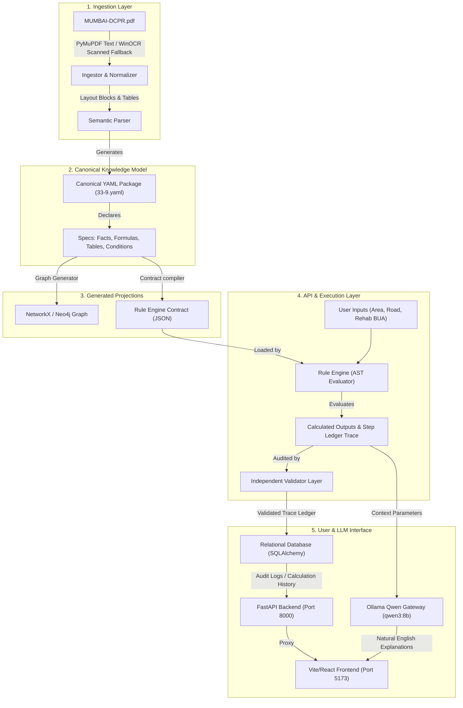

# DCPR 2034 Knowledge Platform: Comprehensive Technical Overview

This document provides a complete technical blueprint and architecture overview of the **DCPR 2034 Knowledge Platform**. Planners and AI models can use this document as a single source of truth to understand the project's architecture, data schemas, engines, and database dependencies.

---

## 1. Project Context & Problem Statement

### What is DCPR 2034?
The **Development Control and Promotion Regulations for Greater Mumbai 2034 (DCPR 2034)** is the statutory document governing all construction, zoning, land use, and floor space approvals in Mumbai. It is a highly complex, interdependent set of legal provisions containing tables, exceptions, formulas, and conditions.

### The Objective
To build a regulatory knowledge base and compliance engine that can evaluate development proposals (specifically starting with **Scheme 33(9) - Cluster Development Scheme**) and answer:
1. **Maximum Permissible Built-Up Area (BUA)** for a cluster scheme.
2. **Applicable Floor Space Index (FSI)** that can be used.
3. **What is included/excluded** in FSI/BUA calculations (e.g. MHADA rehab component, incentive free-sale components, fungible FSI exclusions under Regulation 31(3), TDR under Regulation 32).

---

## 2. Core Architectural Philosophy: "Separation of Math and Reasoning"

To prevent the high risk of mathematical hallucinations or logical deviations inherent in LLMs, the platform adheres to a strict division of labor:
* **The Rule Engine (Deterministic):** Executes mathematical formulas, applies database table lookups (like Table B for incentive rates), checks eligibility constraints (e.g., minimum cluster area and road width), and compiles a detailed **Decision Trace Ledger**.
* **The Auditor (Deterministic):** Performs parallel verification of the math (AST checking, boundary bounds, division-by-zero checks) to validate the engine's outputs.
* **The LLM (Qwen via Ollama) (Probabilistic/Reasoning Only):** Reads the structured inputs, outputs, and the decision trace ledger, translating them into a natural English explanation. **The LLM is completely isolated from calculations and decision-making.**

---

## 3. High-Level System Architecture

The pipeline consists of the following components:



---

## 4. Ingestion Pipeline & The Canonical Knowledge Model (CKM)

Instead of hardcoding rules in python, rules are written as declarative data structures in YAML packages.

### YAML Schema (`knowledge/schemes/33-9.yaml`)
A scheme package declares:
* **`entities`**: Schema tags and metadata.
* **`facts`**: Regulatory constants (e.g. Island City minimum cluster area = `4000 sq. m`, Suburbs minimum area = `6000 sq. m`, minimum access road width = `18 m`).
* **`conditions`**: Logical constraints written in AST format (e.g., `gross_cluster_area >= minimum_cluster_area`).
* **`formulae`**: Mathematical equations (e.g. `weighted_land_rate / construction_rate` for cost ratio).
* **`rate_tables`**: Multi-dimensional coordinate lookups (e.g. **Table B** for incentive rates based on cluster area and basic ratio).
* **`input_contract`** & **`output_contract`**: Explicit typings for parameters.

Example Formula AST structure in YAML:
```yaml
- id: dcpr:33-9:incentive-bua
  raw_expression: certified_admissible_rehabilitation_bua * incentive_rate
  expression:
    op: MULTIPLY
    args:
    - kind: INPUT
      id: certified_admissible_rehabilitation_bua
    - op: LOOKUP
      args:
      - kind: FACT
        id: dcpr:33-9:table-b:incentive-rate
      - kind: DERIVED
        id: basic_ratio
      - kind: INPUT
        id: gross_cluster_area
```

---

## 5. Execution & Validation Engine

1. **Topological Solver:** On execution, the `RuleEngine` analyzes the formulas, builds a dependency DAG using NetworkX, and sorts them topologically (e.g., it calculates `basic_ratio` before looking up `incentive_rate` from Table B, which is then used to compute `incentive_bua`).
2. **AST Evaluator (`ASTEvaluator`):** Recursively evaluates operators (`ADD`, `MULTIPLY`, `DIVIDE`, `MAX`, `GTE`, etc.) using strict `Decimal` arithmetic.
3. **Table Resolver (`TableResolver`):** Resolves cell matching. For instance, in Table B:
   * **X-dimension (Basic Ratio):** Maps a float like `1.5` to range matches (e.g., `up to 2.00`).
   * **Y-dimension (Plot Area):** Maps area like `8000 sq. m` to range bounds (e.g. `0.4ha up to 1ha`).
   * Fetches `85%`, converts it to the multiplier `0.85`.
4. **Independent Auditor (`CalculationValidator`):** Re-runs the calculations in parallel. It audits:
   * Formula math tolerances (using `math.isclose`).
   * Boundaries and constraints.
   * Rounding errors and division-by-zero checks.
   * Outputs `PASS` or `FAIL` with a list of validation warnings.

---

## 6. The Graph Network Layer

The application maps the dependencies and regulatory citation lineage into a directed graph structure.
* **Nodes:** represent Schemes, Regulations, Conditions, Tables, Formulas, and Inputs.
* **Edges:** represent relationships:
  * `USES_FORMULA` (e.g., Scheme 33(9) uses Applicable FSI Formula).
  * `DEPENDS_ON` (e.g., Incentive BUA depends on Table B).
  * `REFERENCES` (e.g., Scheme 33(10) references Regulation 52).
* **Graph Utilities:**
  * **Transitive Dependencies:** Traverses downstream to trace everything that influences a calculation.
  * **Impact Analysis:** Traverses upstream to see which schemes are affected if a specific base regulation or table cell changes.

---

## 7. Infrastructure & Integration Points

The application is built for high resilience, running locally with zero external dependencies via fallback modes, and is ready for production scaling.

### 1. Supabase (Database & File Storage)
* **Hosted Postgres:** Configured by pointing `DATABASE_URL` in `backend/app/core/config.py` to the Supabase Postgres instance. SQLAlchemy maps tables for users, uploaded documents, versions, calculations, step-by-step traces, and Q&A history.
* **Supabase Storage:** Replaces the local PDF upload directory (`backend/storage`). PDFs are uploaded to a bucket via the Supabase SDK, and the secure URLs are stored in the `uploaded_files` table.

### 2. Neo4j (Graph Database)
* **Fallback Mode:** Uses an in-memory NetworkX directed graph stored in `knowledge/graphs/graph.json` if Neo4j is offline.
* **Neo4j Mode:** Communicates via Bolt protocol (`bolt://localhost:7687`). When active, the system enforces uniqueness constraints and loads nodes/relationships directly into Neo4j for visualization and Cypher query traversals.

### 3. Ollama (Local LLM Server)
* **Local QA Inference:** Connected to a local Ollama instance running the `qwen3:8b` model.
* **Prompt Guardrails:** The engine supplies the LLM with the raw inputs, calculations, and the rule trace ledger. The prompt strictly instructs Qwen to never recalculate values and to treat the execution outputs as absolute truth.
* **Fallback Gateway:** If Ollama is offline or loading, the reasoning gateway falls back to a deterministic, template-based compiler to maintain 100% application uptime.

---

## 8. Summary of a Single Execution Trace (Scheme 33(9) Demo)

For a development proposal with inputs:
* **Gross Cluster Area:** `8000 sq. m` (Suburban)
* **Access Road Width:** `18 m`
* **Certified Rehab BUA:** `12000 sq. m`
* **FSI Base Area:** `5000 sq. m`

The system executes in sequence:
1. **Eligibility Check:**
   * Area: `8000 >= 6000` (Suburban threshold) -> **PASS**
   * Road width: `18 >= 18` -> **PASS**
   * Scheme eligibility resolves to **ELIGIBLE**.
2. **Basic Ratio:** `30000 (ASR land rate) / 20000 (ASR construction rate) = 1.50`.
3. **Incentive Rate Lookup:** Maps `basic_ratio = 1.50` and `area = 8000 sq. m` in Table B, resolving to `85%` (**`0.85`**).
4. **Incentive BUA:** `12000 (Rehab BUA) * 0.85 = 10,200 sq. m`.
5. **Rehab FSI:** `12000 (Rehab BUA) / 5000 (Base Plot Area) = 2.40`.
6. **Incentive FSI:** `10200 (Incentive BUA) / 5000 = 2.04`.
7. **Applicable FSI:** `max(4.00, 2.40 + 2.04) = max(4.00, 4.44) = 4.44`.
8. **Maximum BUA Permitted:** `4.44 (Applicable FSI) * 5000 (Plot Area) = 22,200.00 sq. m`.
9. **Balance Free-Sale BUA:** `22200 - 12000 (Rehab) - 10200 (Incentive) = 0.00 sq. m`.
10. **Validation Audit:** Verifies calculations and outputs `PASS`.
11. **Explainability Gateway:** Ollama (Qwen) compiles the explanation detailing how the Rehab FSI component (`2.40`) and the Incentive FSI component (`2.04`) sum up to `4.44` and how Table B coordinates were matched.
