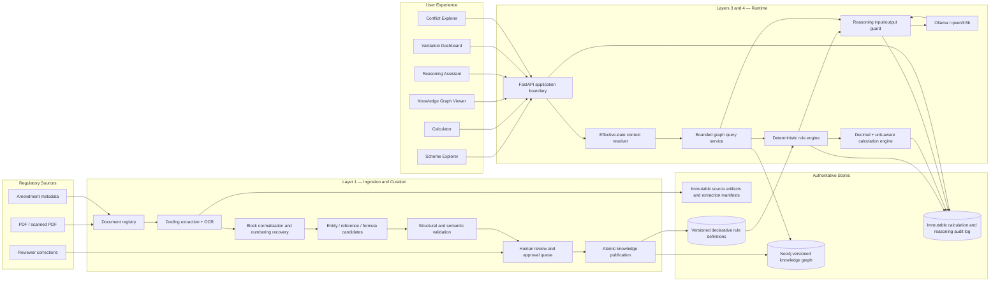
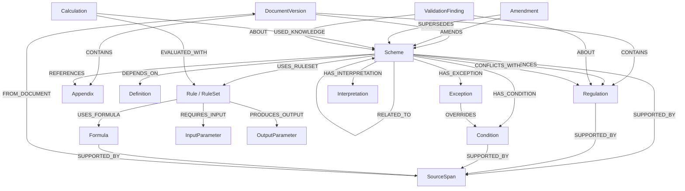
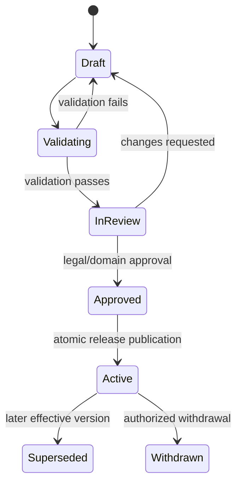
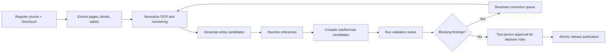

# DCPR Knowledge Engine — Architecture Blueprint

**Status:** Superseded by [Architecture Review V2](architecture-review-v2.md)  
**Date:** 20 June 2026  
**Implementation gate:** No application code should be written until this
blueprint and the decisions in the approval checklist are accepted.

## 0. Executive decision

The DCPR Knowledge Engine will be a versioned regulatory knowledge and
calculation platform, not a PDF chatbot and not an embeddings-first retrieval
application.

The system of record is:

1. source evidence extracted from an identified document version;
2. normalized, effective-dated regulatory entities and relationships in Neo4j;
3. reviewed declarative rules interpreted by a deterministic rule engine; and
4. immutable calculation/audit records containing the exact inputs, rule-set
   version, graph snapshot, outputs, warnings, and reasoning trace.

Qwen is downstream of all deterministic decisions. It can convert structured
results into plain-language explanations, but it cannot calculate, change an
output, infer a missing legal fact, or decide eligibility.

### Architectural principles

- **Evidence before interpretation:** every published fact and rule points to a
  source document, page, and text span.
- **Published knowledge is immutable:** corrections and amendments create new
  versions; they do not rewrite historical results.
- **Deterministic core:** the same inputs, graph snapshot, and rule-set version
  produce the same outputs.
- **No hidden defaults:** every default is a named, versioned policy and appears
  in the trace as an assumption.
- **Fail closed:** incomplete, ambiguous, cyclic, or conflicting decisive data
  produces an indeterminate result, not a guessed result.
- **Human-in-the-loop publishing:** OCR and parser output can be staged
  automatically, but legal knowledge becomes active only after review.
- **Explanations cite evidence:** a statement without a known source is labeled
  as an assumption, interpretation, or “Not found in the knowledge base.”
- **Scale by bounded traversal and indexed identity:** request paths never scan
  the whole graph.

---

# 1. System architecture diagram



## 1.1 Component responsibilities

| Component | Owns | Must not own |
|---|---|---|
| Document registry | Source identity, checksum, edition, effective dates, ingestion status | Legal interpretation |
| Extraction pipeline | Docling output, OCR confidence, page/layout coordinates | Published graph mutations |
| Curation workflow | Candidate review, corrections, approval, rejection | Runtime calculations |
| Neo4j | Regulatory entities, provenance, versions, references, dependencies, interpretations | LLM chat memory |
| Rule store | Validated, immutable rule-set versions | Controller-specific conditionals |
| Rule engine | Applicability, precedence, exceptions, conflict detection, traces | Free-form legal prose |
| Calculation engine | Typed formulas, units, precision, rounding | Eligibility judgments |
| Qwen gateway | Explanation, risks, pros/cons, ambiguity summaries | Numbers or legal outcomes |
| Audit store | Reproducible request/response history | Editable source knowledge |

## 1.2 Recommended technology baseline

- Python 3.12+
- FastAPI and Pydantic v2 for typed APIs
- Neo4j 5.x, with constraints and indexes managed as migrations
- Docling for document conversion and layout-aware extraction
- A restricted in-process rule interpreter using typed abstract syntax trees;
  never Python `eval`
- Python `Decimal` for all regulatory arithmetic
- Pint, or an equivalent allow-listed unit system, for units and conversions
- Ollama with `qwen3:8b` behind an internal reasoning gateway
- PostgreSQL for durable workflow/audit metadata if operational requirements
  exceed Neo4j's suitability for queues and append-only execution records
- S3-compatible object storage in production for source PDFs, page images, and
  extraction manifests; local filesystem only for development
- OpenTelemetry-compatible logs, metrics, and traces

Neo4j remains the primary regulatory knowledge store. PostgreSQL/object storage,
if used, are operational and evidence stores, not competing regulatory sources
of truth.

---

# 2. Knowledge graph schema

## 2.1 Identity and versioning model

Each regulatory entity has:

- a stable `canonical_id`, such as `DCPR:SCHEME:33(9)`;
- a unique immutable `version_id`;
- `effective_from` and nullable `effective_to`;
- `publication_status`: `DRAFT`, `IN_REVIEW`, `PUBLISHED`, `REJECTED`, or
  `SUPERSEDED`;
- the source `document_version_id`;
- source page/span provenance;
- `content_hash` for deduplication;
- confidence and review metadata.

Relationships that can change over time are also effective-dated and carry
source provenance. Runtime queries select one graph view using an explicit
`as_of_date` and approved document/rule-set versions.

This prevents a current amendment from silently changing a calculation that was
performed under an older regulation.

## 2.2 Logical graph



`Rule`, `RuleSet`, `SourceSpan`, and `ValidationFinding` are deliberate
extensions to the minimum node list. They are needed to make rule versions,
evidence, and validation findings first-class and auditable.

## 2.3 Relationship contract

Every published relationship has:

```text
edge_id
effective_from
effective_to
document_version_id
source_span_id
confidence_score
review_status
created_at
```

Important relationship semantics:

| Relationship | Meaning |
|---|---|
| `REFERENCES` | Explicit textual citation; does not alone imply calculation dependency |
| `DEPENDS_ON` | Required semantic dependency during interpretation/evaluation |
| `HAS_CONDITION` | All or grouped conditions controlling applicability |
| `HAS_EXCEPTION` | Exception capable of modifying or bypassing a normal outcome |
| `USES_FORMULA` | Rule invokes a typed, versioned formula |
| `REQUIRES_INPUT` | Input must be supplied or resolved through an explicit policy |
| `PRODUCES_OUTPUT` | Rule/formula declares its output contract |
| `OVERRIDES` | Source-backed precedence link, never inferred solely by chronology |
| `CONFLICTS_WITH` | Reviewed or engine-detected incompatibility |
| `AMENDED_BY` | Earlier provision points to amendment instrument |
| `SUPERSEDES` | New version replaces an earlier version for a time range |
| `HAS_INTERPRETATION` | Non-binding interpretation linked to author/status/evidence |
| `RELATED_TO` | Non-decisive discoverability edge |

## 2.4 Graph integrity rules

- One published entity version per `version_id`.
- No overlapping `PUBLISHED` effective windows for the same `canonical_id`
  unless explicitly marked as parallel interpretations.
- A published source span must resolve to a registered document checksum and
  page.
- Every formula references declared inputs and outputs.
- Every rule references a published source span and rule set.
- All decisive unresolved references block publication.
- Circular `REFERENCES` edges are allowed and reported; circular executable
  `DEPENDS_ON`/rule dependencies are not executable and block activation.
- A `SUPERSEDES` chain must be acyclic and date-consistent.

---

# 3. Neo4j node model

## 3.1 Common entity properties

```yaml
version_id: "uuid"
canonical_id: "DCPR:SCHEME:33(9)"
label: "Scheme 33(9)"
normalized_label: "scheme 33 9"
jurisdiction: "..."
effective_from: "YYYY-MM-DD"
effective_to: null
publication_status: "PUBLISHED"
document_version_id: "uuid"
source_span_ids: ["uuid"]
confidence_score: 0.98
content_hash: "sha256:..."
created_at: "ISO-8601 timestamp"
created_by: "actor id"
reviewed_at: "ISO-8601 timestamp"
reviewed_by: "actor id"
```

Dates shown above are schema formats, not assumed dates for Scheme 33(9).

## 3.2 Type-specific properties

| Label | Important properties |
|---|---|
| `Scheme` | scheme number, title, purpose, status, applicability summary |
| `Regulation` | regulation number, heading, clause path, normalized text |
| `Appendix` | appendix identifier, heading, structural path |
| `Definition` | term, normalized term, definition text, scope |
| `Condition` | condition AST, group identifier, mandatory flag |
| `Exception` | trigger AST, effect, override target, scope |
| `Formula` | expression AST, variables, units, precision, rounding policy |
| `InputParameter` | key, data type, unit, bounds, required flag |
| `OutputParameter` | key, data type, unit, nullable/indeterminate behavior |
| `Rule` | rule id, condition AST, actions, priority, stop policy |
| `RuleSet` | semantic version, knowledge release id, activation state |
| `Interpretation` | text, author type, binding status, confidence, rationale |
| `Amendment` | instrument identifier, notification date, effective date |
| `DocumentVersion` | title, edition, checksum, URI, ingestion status |
| `SourceSpan` | page, block id, bounding box, raw text, corrected text, OCR confidence |
| `Calculation` | request hash, inputs, outputs, trace hash, rule-set version, graph release |
| `ValidationFinding` | code, severity, state, message, first/last observed timestamps |

## 3.3 Constraints and indexes

Initial Neo4j constraints/indexes:

```cypher
CREATE CONSTRAINT entity_version IF NOT EXISTS
FOR (n:RegulatoryEntity) REQUIRE n.version_id IS UNIQUE;

CREATE CONSTRAINT document_version IF NOT EXISTS
FOR (d:DocumentVersion) REQUIRE d.document_version_id IS UNIQUE;

CREATE CONSTRAINT source_span IF NOT EXISTS
FOR (s:SourceSpan) REQUIRE s.source_span_id IS UNIQUE;

CREATE CONSTRAINT rule_version IF NOT EXISTS
FOR (r:Rule) REQUIRE r.rule_version_id IS UNIQUE;

CREATE INDEX canonical_effective IF NOT EXISTS
FOR (n:RegulatoryEntity)
ON (n.canonical_id, n.publication_status, n.effective_from, n.effective_to);

CREATE INDEX normalized_label IF NOT EXISTS
FOR (n:RegulatoryEntity) ON (n.normalized_label);

CREATE INDEX finding_lookup IF NOT EXISTS
FOR (f:ValidationFinding) ON (f.document_version_id, f.severity, f.state);
```

All domain labels also carry `:RegulatoryEntity` to support common constraints
and indexed effective-date resolution.

## 3.4 Graph query policy

- API queries start from indexed `canonical_id` or `version_id`.
- Traversal depth is explicit and capped, with a default of 2 and a hard API
  limit chosen during performance testing.
- Result size is paginated and subject to node/edge caps.
- Cycle-aware path expansion records visited `version_id` values.
- Runtime calculations use a materialized bounded subgraph identified by a
  `knowledge_release_id`; they do not traverse unconstrained live data.
- Neo4j writes happen through a publication service, never directly from web
  controllers or the LLM.

---

# 4. Rule and calculation engine design

## 4.1 Rule lifecycle



Rules are authored as structured data, schema-validated, source-linked, reviewed,
and published as an immutable `RuleSet`. Controllers only select and invoke a
rule set.

## 4.2 Declarative rule shape

Illustrative structure only:

```yaml
rule_id: "DCPR:SCHEME:33(9):ELIGIBILITY:001"
version: "1.0.0"
effective_from: "YYYY-MM-DD"
source_refs:
  - source_span_id: "uuid"
scope:
  scheme_id: "DCPR:SCHEME:33(9)"
requires:
  - plot_area
when:
  all:
    - op: "greater_than"
      left: { input: "plot_area" }
      right: { quantity: "0", unit: "square_metre" }
then:
  - set:
      output: "eligibility"
      value: true
priority: 100
on_missing: "INDETERMINATE"
```

The example says only that positive plot area is a possible validation
condition. It is not a legal eligibility rule for Scheme 33(9).

## 4.3 Expression language

The DSL supports an allow-list of typed operations:

- boolean: `all`, `any`, `not`;
- comparison: equality, ordered comparisons, inclusive/exclusive ranges;
- arithmetic: add, subtract, multiply, divide, min, max;
- set operations: contains, intersects, subset;
- date operations: before, after, within effective interval;
- lookups: graph fact by approved identifier and version;
- decisions: set output, append component, emit constraint, emit warning;
- formulas: invoke a named formula with typed parameters.

It does not support arbitrary code, network access, file access, reflection, or
dynamic imports.

## 4.4 Evaluation stages

1. **Request validation**
   - validate types, units, ranges, scheme identifier, and `as_of_date`;
   - reject negative physical values where impossible;
   - distinguish missing from explicit zero.
2. **Context resolution**
   - select one published knowledge release and compatible rule set;
   - load only the bounded dependency closure;
   - verify required evidence is still active for the requested date.
3. **Dependency planning**
   - build a directed rule dependency graph;
   - topologically sort it;
   - stop with `CIRCULAR_DEPENDENCY` if an executable cycle exists.
4. **Applicability**
   - evaluate conditions to `TRUE`, `FALSE`, or `UNKNOWN`;
   - retain rejected candidates and reasons in the trace.
5. **Normal rule execution**
   - calculate candidate outputs with `Decimal` and explicit units.
6. **Exception execution**
   - evaluate source-backed exception triggers;
   - apply only declared override effects.
7. **Precedence and conflict resolution**
   - compare explicit override links first;
   - then use approved precedence metadata;
   - never invent legal precedence from graph proximity.
8. **Output validation**
   - validate output types, units, invariants, and component totals.
9. **Audit persistence**
   - save input hash, graph/rule versions, trace, outputs, warnings, and
     software build id.

## 4.5 Three-valued decisions

Conditions return:

- `TRUE`: proven by available, valid inputs/facts;
- `FALSE`: disproven;
- `UNKNOWN`: a required value or decisive knowledge item is missing/ambiguous.

Eligibility therefore returns `ELIGIBLE`, `NOT_ELIGIBLE`, or `INDETERMINATE`.
This is safer than coercing missing information to false.

## 4.6 Precedence model

Precedence is represented as reviewed data:

1. explicit `OVERRIDES` relationship;
2. legally defined instrument hierarchy;
3. scope specificity, only where a reviewed policy authorizes it;
4. effective date/version applicability;
5. declared rule priority as a final implementation ordering mechanism, not a
   substitute for legal hierarchy.

If two active rules of equal legal precedence assign incompatible values to the
same output, the engine returns `CONFLICT` and withholds a decisive output. A
reviewer may resolve it only by publishing an interpretation or corrected rule
with provenance.

## 4.7 Calculation model

- All quantities use `Decimal`; binary floating point is prohibited.
- Inputs and outputs carry units.
- Unit conversion uses an allow-listed registry.
- Division by zero and invalid dimensions are explicit errors.
- Rounding occurs only at a named regulatory or presentation boundary.
- Every formula declares precision and rounding mode.
- Intermediate values are retained at full configured precision in the trace.
- `maximum_bua` is produced only by an approved formula. The engine must not
  assume `plot_area × FSI` unless the active rules explicitly define that
  relationship and all relevant inclusions/exclusions.

## 4.8 Reasoning trace

Each trace entry includes:

```json
{
  "sequence": 12,
  "rule_id": "stable rule id",
  "rule_version": "immutable version",
  "result": "TRUE",
  "inputs_used": {},
  "facts_used": [],
  "calculation": null,
  "output_changes": [],
  "source_refs": [],
  "message_code": "CONDITION_SATISFIED"
}
```

Human-readable messages are rendered from message codes and structured values;
the trace itself is machine-readable and reproducible.

## 4.9 Comparing multiple schemes

Scheme comparison executes each candidate independently against the same:

- normalized input set;
- `as_of_date`;
- knowledge release;
- engine build.

The comparison layer presents eligibility, outputs, constraints, exceptions,
missing inputs, conflicts, and evidence side by side. It does not rank a scheme
as “best” unless an explicit, user-selected objective and approved comparison
policy exist.

---

# 5. Validation engine design

## 5.1 Ingestion and publication pipeline



The raw extraction is never discarded. Normalized/corrected text is stored next
to, not over, the OCR text.

## 5.2 Validation suites

### Document validation

- duplicate file checksum and edition detection;
- page count and extraction completeness;
- blank/suspicious pages;
- OCR confidence threshold by block;
- table/formula extraction confidence;
- changed-page detection against prior document versions.

### Structural validation

- duplicate canonical IDs;
- malformed and broken numbering;
- unexpected heading-level jumps;
- duplicate or near-duplicate clauses;
- orphan clauses and appendices;
- inconsistent aliases for the same provision.

### Reference validation

- unresolved explicit reference;
- ambiguous target;
- target exists only in an incompatible document/effective version;
- circular reference path;
- reference text disagrees with resolved target type.

### Temporal/amendment validation

- overlapping effective windows;
- `effective_to` before `effective_from`;
- supersession cycles;
- amendment target absent;
- amended text unchanged or changed without amendment metadata;
- rule-set effective range incompatible with source provision.

### Rule validation

- DSL schema and type checking;
- undeclared input/output;
- incompatible units;
- unreachable rule;
- contradictory conditions;
- circular executable dependency;
- exception without target/effect;
- equal-precedence output conflict;
- missing source evidence;
- non-deterministic operation attempt.

### Calculation validation

- known worked examples;
- boundary values and just-below/at/just-above threshold cases;
- dimensional analysis;
- rounding-policy tests;
- component-total invariants;
- overflow, division-by-zero, and precision tests.

### Graph validation

- required relationship cardinality;
- effective-date consistency across nodes and edges;
- bounded reachability from a scheme to its active rules and sources;
- forbidden executable cycles;
- source span existence;
- publication-status consistency.

## 5.3 Finding severity and publication policy

| Severity | Meaning | Publication effect |
|---|---|---|
| `BLOCKER` | Decisive integrity/evidence failure | Release cannot publish |
| `ERROR` | Incorrect or ambiguous data likely to change an outcome | Affected entity/rule cannot publish |
| `WARNING` | Suspicious but potentially valid structure | Requires review/waiver |
| `INFO` | Non-decisive observation | Visible in report |

Every waiver has a reviewer, reason, timestamp, scope, and expiry/review date.

## 5.4 OCR confidence policy

Confidence is kept at document, page, block, entity, and extracted-field level.
The entity confidence is not blindly averaged: decisive fields such as a
threshold, operator, exception word, formula symbol, or reference identifier
are individually checked. Low-confidence decisive text blocks publication;
low-confidence explanatory prose creates a warning and review task.

## 5.5 Manual correction model

A correction records:

- raw text;
- corrected text;
- source bounding box/page image;
- correction reason;
- corrector and reviewer;
- timestamps;
- affected candidates/rules;
- correction version.

Corrections are replayable on re-ingestion and flagged when a new source edition
changes the corrected region.

---

# 6. Edge case analysis

| Edge case | Detection | Required behavior |
|---|---|---|
| Missing referenced regulation | Reference resolver has no unique active target | Finding; decisive reference blocks publication/evaluation |
| Duplicate regulation ID | Same canonical ID/effective range appears more than once | Quarantine candidates; require merge/version decision |
| Broken numbering | Sequence parser detects a gap | Warning by default; error only if a referenced/required clause is absent |
| OCR changes `4.0` to `40` | Low confidence plus numeric plausibility/diff checks | Block decisive numeric field pending review |
| OCR drops “not” | Token-level confidence and edition diff | Block affected rule; show source image to reviewer |
| Circular textual references | Cycle-aware graph traversal | Return cycle path and continue only if non-executable |
| Circular rule dependency | Dependency planner cannot topologically sort | Stop evaluation as indeterminate |
| Conflicting active regulations | Same scoped output, incompatible values, no precedence | Return conflict; do not select a value |
| Multiple schemes apply | Independent evaluations share one context | Side-by-side comparison with no hidden ranking |
| Missing required input | Rule dependency analysis identifies unresolved input | Return `MISSING_INPUTS`, partial non-decisive trace, no guessed default |
| Negative/invalid area | Input schema/range/unit validation | HTTP 422 with field-specific error |
| Zero area | Validity policy distinguishes zero from missing | Reject or evaluate per explicit domain rule; never silently treat as missing |
| Version mismatch | Rule set references a different knowledge release/effective period | Refuse evaluation and report compatible versions |
| Exception overrides | Exception trigger succeeds and explicit target exists | Apply after normal rules; record before/after values and source |
| Exception itself conflicts | Multiple equal-precedence exceptions disagree | Return conflict |
| Incomplete regulation data | Required evidence/relationship/rule absent | Indeterminate plus validation findings |
| Multiple valid interpretations | Published interpretations apply in parallel | Return scenario outputs separately; do not merge |
| Amendment retroactivity | Effective dates and legal metadata indicate retroactive scope | Select by policy and show retroactivity explicitly |
| Request date on boundary | Inclusive/exclusive date semantics are declared | Deterministic version selection with tests |
| Duplicate ingestion | Same source checksum/idempotency key | No duplicate publication; return existing run |
| Partial publication failure | Transaction/release pointer fails | Keep prior release active; new release remains unpublished |
| Neo4j unavailable | Health check/circuit breaker | No calculation from stale unknown graph unless an explicitly pinned snapshot is valid |
| Ollama unavailable | Reasoning call fails | Deterministic result remains available; explanation marked unavailable |
| Qwen invents a citation/value | Output schema/citation allow-list detects unknown content | Reject/regenerate once, then return guarded fallback |
| Prompt injection in regulation text | Source content is treated as quoted data | Model instructions and structured schema remain authoritative |
| Huge graph expansion | Depth/result budgets | Truncate non-decisive visualization with continuation token; never truncate calculation dependencies |
| Concurrent amendment publication | Optimistic release/version lock | One atomic release wins; loser revalidates |

---

# 7. Proposed folder structure

```text
DCPR/
├── README.md
├── docs/
│   ├── architecture-blueprint.md
│   ├── adr/
│   ├── api/
│   └── runbooks/
├── apps/
│   ├── api/                       # FastAPI delivery layer
│   ├── worker/                    # ingestion/validation jobs
│   └── web/                       # six-page user interface
├── packages/
│   ├── domain/                    # entities, value objects, errors
│   ├── ingestion/                 # Docling adapters and normalization
│   ├── knowledge_graph/           # ports, Neo4j adapter, queries
│   ├── rule_engine/               # DSL, compiler, evaluator, traces
│   ├── calculation_engine/        # Decimal, units, formulas
│   ├── validation/                # validation suites/findings
│   ├── reasoning/                 # Ollama adapter and strict guards
│   └── audit/                     # immutable execution records
├── knowledge/
│   ├── manifests/                 # document/release manifests
│   ├── schemas/                   # JSON Schema for rules/knowledge
│   ├── rules/                     # reviewed rule definitions
│   ├── corrections/               # replayable human corrections
│   └── fixtures/                  # non-authoritative test fixtures
├── migrations/
│   └── neo4j/
├── tests/
│   ├── unit/
│   ├── integration/
│   ├── contract/
│   ├── api/
│   ├── graph_validation/
│   ├── rule_validation/
│   ├── edge_cases/
│   └── golden/                    # legally reviewed worked examples
├── infra/
│   ├── docker/
│   ├── compose/
│   └── observability/
├── scripts/
└── pyproject.toml
```

The package boundaries follow domain responsibilities. The API cannot import a
Neo4j driver, Docling, or Ollama directly; it calls application services through
ports. This keeps deterministic domain tests fast and infrastructure-independent.

---

# 8. Implementation roadmap

## Phase 0 — Decisions and source readiness

Approval criteria:

- architecture decisions accepted;
- authoritative Scheme 33(9) source PDFs and amendment chain supplied;
- legal/domain reviewer identified;
- effective-date and jurisdiction semantics confirmed;
- at least three approved worked examples, including one exception/boundary
  case, available;
- hosting, audit retention, and access-control needs agreed.

## Phase 1 — Foundation

Deliver:

- Python workspace and quality gates;
- configuration/secrets model;
- Neo4j local environment and migrations;
- domain IDs, effective-date value objects, provenance model;
- health/readiness endpoints;
- CI with linting, type checking, unit tests, and dependency scanning.

Exit: constraints apply cleanly and a release can be created/rolled back in a
test environment.

## Phase 2 — Ingestion and curation

Deliver:

- document registry and checksum-based idempotency;
- Docling extraction adapter;
- raw/normalized block manifests;
- numbering, entity, reference, and amendment candidate extraction;
- validation findings and correction workflow;
- staged-to-published release process.

Exit: Scheme 33(9) and every dependency can be traced to source spans, with all
blocking findings resolved.

## Phase 3 — Graph services

Deliver:

- effective-dated graph publication;
- scheme, reference, amendment, conflict, and bounded graph queries;
- cycle detection;
- release-pinned graph snapshots;
- graph validation tests.

Exit: all read APIs return source-backed versioned data for an explicit date.

## Phase 4 — Rule and calculation engine

Deliver:

- JSON/YAML rule schemas and typed AST;
- compiler/validator;
- dependency planner;
- three-valued evaluator;
- precedence, conflict, and exception handling;
- Decimal/unit formula evaluator;
- immutable trace and audit record.

Exit: golden Scheme 33(9) scenarios reproduce reviewer-approved outcomes and all
edge-case tests pass without any LLM involvement.

## Phase 5 — APIs

Deliver:

- `POST /calculate`
- `POST /reason`
- `GET /scheme/{id}`
- `GET /graph/{id}`
- `GET /references/{id}`
- `GET /explain/{id}`
- `GET /validation-report/{id}`
- `GET /conflicts/{id}`
- `GET /amendments/{id}`
- OpenAPI contracts, auth scopes, request IDs, pagination, and rate limits.

Exit: API contract and integration tests pass; every calculation is reproducible
from its audit ID.

## Phase 6 — Guarded Qwen reasoning

Deliver:

- structured reasoning request schema;
- citation allow-list and numeric-output guard;
- response schema for explanation, pros, cons, risks, assumptions, warnings,
  alternatives, compliance notes, and interpretation notes;
- “Not found in the knowledge base” fallback;
- prompt-injection and hallucination tests.

Exit: Qwen cannot introduce a new decisive number, regulation identifier, or
eligibility status.

## Phase 7 — User interface

Deliver:

- Scheme Explorer;
- Calculator;
- bounded Knowledge Graph Viewer;
- Reasoning Assistant tied to calculation IDs;
- Validation Dashboard;
- Conflict Explorer;
- accessible source citations and trace views.

Exit: reviewers can move from an outcome to the exact rule and source span.

## Phase 8 — Operational hardening

Deliver:

- backup/restore and disaster-recovery test;
- audit retention and privacy controls;
- observability dashboards and alerts;
- load/performance testing;
- threat model and penetration fixes;
- runbooks for source correction, amendment publication, model outage, and graph
  rollback.

Exit: agreed service-level and recovery objectives are demonstrated.

---

# 9. Risk analysis

| Risk | Impact | Mitigation |
|---|---|---|
| Incorrect legal transcription | Wrong regulatory output | Source spans, confidence gates, dual review for decisive rules, golden examples |
| Amendment/effective-date ambiguity | Historically incorrect answer | Immutable versions, explicit `as_of_date`, temporal validation, legal review |
| Hidden assumptions | Non-auditable decisions | Named policies, three-valued logic, assumptions in trace |
| Rule precedence encoded incorrectly | Wrong conflict resolution | Source-backed override edges and reviewed hierarchy; fail closed |
| Formula/rounding error | Incorrect BUA/FSI | Decimal, units, dimensional tests, approved worked examples |
| OCR confidence appears high but text is wrong | False trust | Edition diffs, numeric/operator heuristics, visual review of decisive fields |
| LLM hallucinates or changes result | Misleading explanation | Structured inputs/outputs, allow-list validation, reject unknown citations/numbers |
| Prompt injection in source/user text | Guard bypass | Data/instruction separation, no tools for Qwen, strict response validation |
| Graph grows into slow traversals | Latency/timeouts | Indexed anchors, release snapshots, bounded traversal, query budgets |
| Knowledge and rule releases drift | Inconsistent result | Compatibility manifest and atomic release pointer |
| Manual correction is lost on re-ingestion | Regression | Versioned replayable correction overlays and changed-region alerts |
| Reviewer bottleneck | Slow content onboarding | Risk-based queues, machine-assisted candidates, never automatic decisive publishing |
| Overfitting architecture to 33(9) | Expensive expansion | Generic IDs, DSL, node/edge types, no scheme-specific controller logic |
| Legal users treat explanations as legal advice | Liability/misuse | Scope notices, evidence display, uncertainty language, reviewer workflow |
| Sensitive project inputs leak | Privacy/security | Data minimization, encryption, access scopes, retention policy, no training use |
| Dependency/model outage | Partial service loss | Deterministic core independent of Qwen; health checks and graceful degradation |

## 9.1 Security boundaries

- Authentication is required outside local development.
- Roles: viewer, calculator user, curator, reviewer, publisher, administrator.
- Only publishers can activate a release; rule publishing should require
  separation of duties.
- Every mutation and publication event is audited.
- Source uploads are malware-scanned and content-type/size constrained.
- Cypher queries are parameterized and assembled from allow-listed query shapes.
- Rule definitions are validated data, never executable Python.
- Qwen has no database credentials, filesystem access, or mutation tools.
- Secrets are provided by a secret manager and never stored in knowledge files.

---

# 10. Future scalability plan

## 10.1 Scale targets

The 100,000-node target is modest for Neo4j; relationship density and query
shape matter more than raw node count. The design should still be tested at
10x expected relationship volume and with pathological reference cycles.

## 10.2 Scaling measures

### Knowledge publication

- use batch writes with uniqueness constraints;
- stage releases under immutable `knowledge_release_id` values;
- validate before atomically switching the active release pointer;
- store content hashes to avoid rewriting unchanged entities;
- partition ingestion work by document/page while reconciling references in a
  separate deterministic phase.

### Runtime graph access

- anchor all queries on indexed IDs;
- precompute each active scheme's decisive dependency closure;
- cache immutable release-pinned scheme projections;
- paginate exploratory relationships;
- keep visualization traversal separate from calculation traversal;
- inspect query plans and set latency/cardinality budgets in CI.

### Rule evaluation

- compile and cache validated ASTs by `rule_set_version`;
- topologically order dependencies at publication time;
- preflight required inputs before evaluation;
- evaluate independent candidate schemes in parallel;
- preserve one deterministic output ordering.

### API and workers

- keep API instances stateless;
- run extraction/validation as idempotent background jobs;
- use queue backpressure and per-document concurrency limits;
- separate ingestion compute from low-latency calculation services;
- cache only immutable/release-keyed data.

### Data lifecycle

- retain historical graph/rule releases according to legal/audit policy;
- archive raw artifacts to lower-cost immutable storage;
- keep calculation records addressable by audit ID;
- rehearse restore and replay from source manifest to published release.

### Evolution beyond Phase 1

- introduce jurisdiction and document-family namespaces from the start;
- add new regulatory types via schema migrations, not ad hoc labels;
- preserve backward-compatible API response envelopes;
- version DSL and provide deterministic migrations;
- maintain corpus-wide regression suites plus scheme-specific golden cases;
- add multilingual display as a presentation concern while retaining one
  reviewed canonical rule representation.

---

# 11. API contract direction

## 11.1 Calculation request

```json
{
  "scheme_ids": ["DCPR:SCHEME:33(9)"],
  "as_of_date": "YYYY-MM-DD",
  "inputs": {
    "plot_area": { "value": "2000", "unit": "square_metre" },
    "road_width": { "value": "18", "unit": "metre" }
  },
  "interpretation_policy": "RETURN_ALL"
}
```

## 11.2 Calculation response envelope

```json
{
  "calculation_id": "uuid",
  "status": "SUCCESS",
  "knowledge_release_id": "uuid",
  "rule_set_version": "semver",
  "as_of_date": "YYYY-MM-DD",
  "results": [],
  "missing_inputs": [],
  "conflicts": [],
  "warnings": [],
  "assumptions": [],
  "reasoning_trace": [],
  "references": []
}
```

Possible status values include `SUCCESS`, `INDETERMINATE`, `CONFLICT`,
`MISSING_INPUTS`, `INVALID_INPUT`, and `VERSION_MISMATCH`.

## 11.3 Reasoning contract

`POST /reason` accepts a `calculation_id` and optional user question. The gateway
loads only the persisted structured calculation and its allow-listed evidence.
The validated response is:

```json
{
  "explanation": "...",
  "pros": [],
  "cons": [],
  "risks": [],
  "warnings": [],
  "assumptions": [],
  "alternative_scenarios": [],
  "compliance_notes": [],
  "interpretation_notes": [],
  "citations": []
}
```

The guard rejects:

- numeric literals not present in the allowed structured input, except harmless
  list ordinals/dates explicitly permitted by schema;
- unknown regulation/source IDs;
- changed eligibility/status values;
- unsupported claims presented as facts.

When explanation generation fails validation, the API returns a deterministic
template built from the trace rather than unsafe model output.

---

# 12. Testing strategy

## 12.1 Test layers

- **Unit:** DSL parsing, tri-state operators, precedence, units, precision,
  number normalization, reference parsing.
- **Property-based:** arithmetic invariants, date windows, ordering stability,
  malformed inputs, graph cycles.
- **Rule validation:** unreachable rules, missing evidence, undeclared values,
  incompatible units, conflicts.
- **Graph validation:** duplicate IDs, missing references, temporal overlap,
  supersession/reference cycles.
- **Integration:** Neo4j publication/query, Docling fixture ingestion, Ollama
  gateway with deterministic stubs.
- **API:** schema, auth, status mapping, pagination, idempotency, audit IDs.
- **Golden:** reviewer-approved Scheme 33(9) cases with exact expected trace and
  outputs.
- **Mutation:** alter comparison operators, thresholds, and exception ordering
  to prove tests detect regulatory logic changes.
- **Security:** prompt injection, malicious uploads, Cypher injection, oversized
  graph queries, rule DSL escape attempts.
- **Performance:** release publication, bounded graph reads, single/multi-scheme
  calculations, concurrent reads during publication.

## 12.2 Required Phase 1 edge cases

- every threshold at below/equal/above boundaries;
- absent versus zero input;
- negative and wrong-unit input;
- missing decisive reference;
- circular non-executable references;
- circular executable dependencies;
- normal rule with one applicable and one non-applicable exception;
- conflicting equal-precedence outputs;
- superseded versus current version on exact effective-date boundaries;
- multiple published interpretations;
- Qwen unavailable and Qwen response-guard rejection.

No golden expected value should be authored by the implementation team alone.
It must be approved against source evidence by the designated domain reviewer.

---

# 13. Observability and audit

Metrics:

- ingestion pages/second and failure rate;
- low-confidence decisive fields;
- unresolved references and findings by severity;
- publication duration and rollback count;
- graph query latency/cardinality;
- rule evaluation latency and status distribution;
- conflict/indeterminate rates;
- Qwen latency, availability, and guard rejection rate.

Each request carries a correlation ID. Calculation logs avoid sensitive raw
project details where possible and refer to the secured audit record. Audit
records contain the engine build, schema version, graph release, rule-set
version, and hashes needed for reproducibility.

---

# 14. Approval checklist and open decisions

Implementation should begin only after the following are answered and accepted:

- [ ] Confirm Neo4j 5.x as the regulatory source of truth.
- [ ] Confirm Python/FastAPI as the backend baseline.
- [ ] Confirm immutable effective-dated entity and relationship versions.
- [ ] Confirm the declarative rule DSL and strict prohibition on hardcoded
      scheme logic in controllers.
- [ ] Confirm `Decimal`, units, explicit precision, and explicit rounding policy.
- [ ] Confirm fail-closed outcomes for decisive missing data and conflicts.
- [ ] Confirm Qwen is explanation-only and may be bypassed without losing the
      deterministic calculation result.
- [ ] Supply the authoritative Scheme 33(9) source PDF(s), appendices,
      regulations, definitions, amendment instruments, and effective dates.
- [ ] Identify the legal/domain reviewers and release approvers.
- [ ] Supply approved worked examples and expected outcomes.
- [ ] Decide whether PostgreSQL is acceptable for workflow/audit metadata while
      Neo4j remains the regulatory source of truth.
- [ ] Choose deployment target and S3-compatible evidence storage.
- [ ] Define authentication provider, roles, retention, and data residency.
- [ ] Define whether interpretations are internal guidance, legal opinions, or
      both, and who may publish each.
- [ ] Define target service levels and expected calculation concurrency.

## Recommended approval outcome

Approve the architecture with one explicit condition: Phase 1 regulatory
implementation starts only after the complete authoritative Scheme 33(9)
document set and reviewer-approved examples are available. Without those, the
team may build platform foundations and synthetic fixtures, but it must not
publish a legal calculation as authoritative.
