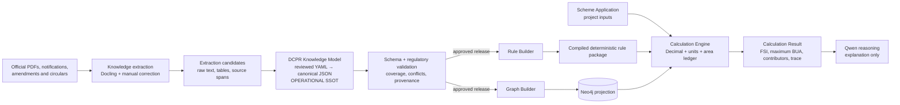
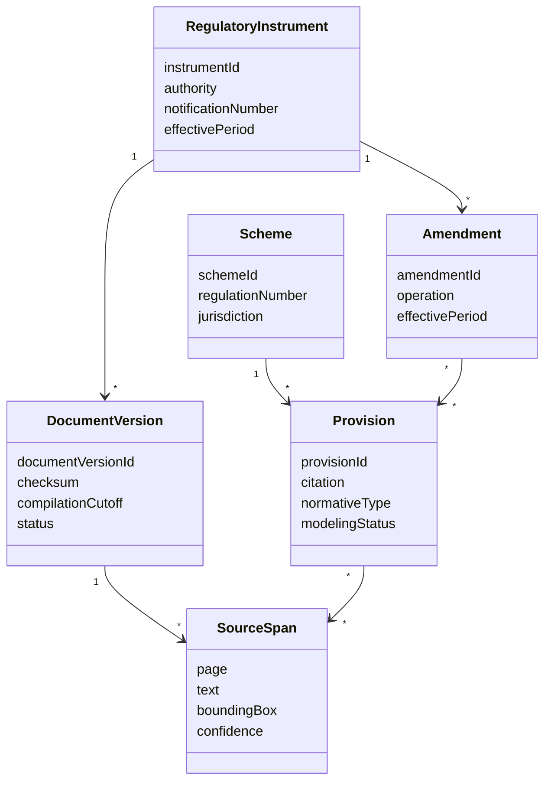
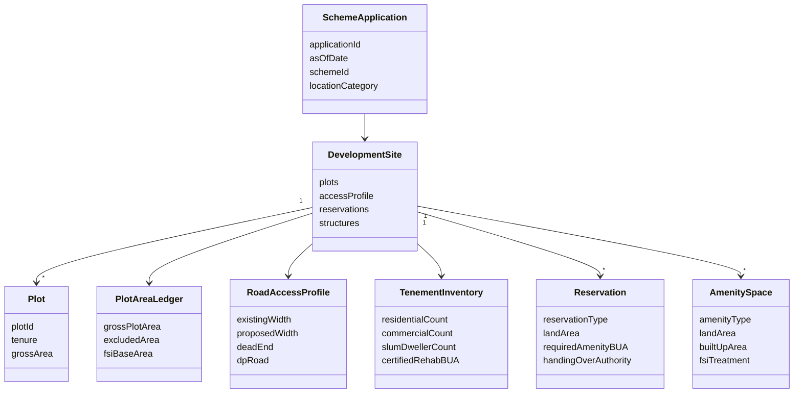
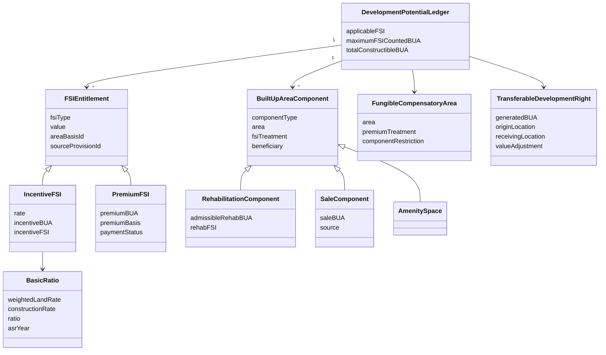
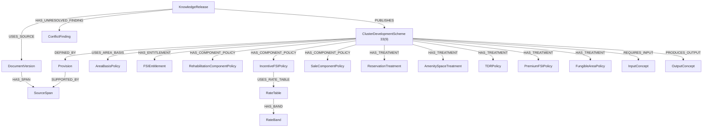

# DCPR Knowledge Engine — Architecture Review V2

**Status:** Source-of-truth review retained; scalability extended by
[Corpus-Scale Architecture V3](corpus-scale-architecture-v3.md)  
**Date:** 20 June 2026  
**Scope:** Correctly model and demonstrate DCPR 2034 Scheme 33(9) in one week  
**Decision:** Neo4j and executable rules are generated projections. The
reviewed DCPR Knowledge Model is the operational single source of truth.

## 1. Review verdict

The first blueprint got several boundaries right:

- deterministic calculations are isolated from Qwen;
- rules are declarative rather than controller logic;
- source spans, effective dates, amendments, audit traces, and fail-closed
  behavior are required;
- `Decimal`, units, explicit assumptions, and three-valued decisions are
  appropriate.

Its central weakness is nevertheless serious: it treats Neo4j as the primary
regulatory knowledge store while also maintaining a separate rule store. That
creates two independently mutable representations of the same regulation.
Atomic release identifiers reduce operational mismatch, but they do not prevent
semantic drift, duplicated constants, or different interpretations being encoded
in graph and rule data.

The first blueprint also jumps from extraction candidates directly to graph and
rules. It lacks a reviewed DCPR-specific semantic layer in which concepts such as
FSI, rehabilitation BUA, reservations, incentive FSI, and TDR have precise
meanings and area-accounting behavior.

### Direct answers

1. **Is Neo4j incorrectly treated as the primary source of truth?**  
   Yes. Neo4j should be a query-optimized projection, not the authored source of
   regulatory meaning.

2. **Should a DCPR Knowledge Model sit between ingestion, graph, and rules?**  
   Yes. It is the missing architectural center.

3. **Should regulations first be represented as structured JSON/YAML?**  
   Yes for all knowledge used by the graph, rules, calculations, and
   explanations. Prose that is not yet formalized must still be represented with
   an explicit `modeling_status`, rather than silently omitted.

4. **How are graph drift, rule drift, and duplicate logic prevented?**  
   Graphs and executable rules are deterministically compiled from the same
   immutable knowledge release. They are never hand-edited.

5. **What is the single source of truth?**  
   A reviewed, schema-valid, versioned DCPR Knowledge Package in YAML, normalized
   to canonical JSON for hashing and release. PDFs remain legal evidence; the
   Knowledge Package is the system's only authored operational interpretation.

## 2. Evidence discovered during review

The source registry must distinguish a document's web upload date from its legal
currency. The Maharashtra Directorate of Town Planning currently hosts a file at
a `2025/01` URL, but the file itself says:

- effective from 13 November 2018; and
- updated only through 7 December 2018.

More importantly, two government-hosted DCPR copies inspected for this review
contain materially different Scheme 33(9) text:

| Topic | DTP-hosted compilation | MCGM-hosted compilation inspected |
|---|---:|---:|
| Minimum CDS area in suburbs/extended suburbs | 6,000 sq. m | 10,000 sq. m |
| Overall eligible-occupant consent | 60% | 70% |
| Minimum slum-dweller rehab carpet area | 27.88 sq. m | 25.00 sq. m |

These differences may reflect different amendment states, marked-up drafting, or
compilation quality. This review does **not** decide which is legally current.
That requires the sanction notification and complete amendment chain.

This is not a side issue. It proves why neither “latest URL,” OCR output, nor a
Neo4j node can be treated as authoritative without:

- source checksum;
- declared compilation cutoff;
- notification/amendment lineage;
- effective period;
- conflict findings; and
- an explicit reviewer resolution.

Official source candidates:

- [Maharashtra DTP DCPR compilation](https://dtp.maharashtra.gov.in/wp-content/uploads/2025/01/MUMBAI-DCPR.pdf)
- [MCGM DCPR 2034 and notification](https://www.mcgm.gov.in/irj/go/km/docs/documents/EODB/Construction%20Permit/Related%20Circulars/DCPR-%202034%20and%20Notification.pdf)

## 3. Weaknesses in the original architecture

| Weakness | Consequence | Correction |
|---|---|---|
| Neo4j is called the primary regulatory store | Graph shape becomes regulatory meaning; manual graph fixes can change law | Treat Neo4j as a disposable projection |
| Separate graph and rule stores | Split-brain releases and duplicated facts | Compile both from one Knowledge Package |
| Generic `Condition` and `Formula` dominate the model | DCPR concepts are hidden inside AST blobs | Add a typed DCPR Domain Model |
| No canonical intermediate representation | OCR/parser output can flow directly into runtime structures | Require review and schema validation before compilation |
| Rule examples embed literals | Thresholds and rates can be copied into several rules | Store each legal value once as a named provision fact or table |
| Graph relationships can carry independently authored semantics | `OVERRIDES`, `DEPENDS_ON`, and rule precedence can disagree | Derive relationships from canonical references and policies |
| No explicit area ledger | “Maximum BUA” can accidentally mix counted, exempt, fungible, and off-site area | Use typed BUA components and FSI treatment |
| `plot_area × FSI` is cautioned against but not replaced by a domain formula | The engine still lacks a precise denominator/numerator model | Introduce `AreaBasis` and `DevelopmentPotentialLedger` |
| Project facts and regulatory facts are not clearly separated | Tenant/project data may contaminate the regulatory graph | Use separate Knowledge Model and Scheme Application input model |
| Infrastructure roadmap is production-heavy | One-week demo is buried under queues, S3, RBAC, observability, and workflow systems | Use Git + YAML + FastAPI + Neo4j + Ollama locally |
| Full automated ingestion is prioritized too early | OCR engineering consumes the demo week | Manually curate 33(9), retaining source spans; automate later |
| “Current version” resolution is underspecified | Official-hosted but stale/conflicting compilations may be selected | Add source authority, cutoff, amendment lineage, and conflict resolution |

## 4. Revised architecture



The requested linear flow is conceptually:

```text
PDF
  ↓
Knowledge Extraction
  ↓
DCPR Knowledge Model
  ↓
Graph Builder + Rule Builder
  ↓
Calculation Engine
  ↓
Qwen Reasoning
```

Graph Builder and Rule Builder should be sibling compilers, not a chain in which
rules are inferred from Neo4j. If Rule Builder consumes the graph, graph modeling
choices can alter executable law. Both builders must consume the same canonical
model.

### 4.1 Authority hierarchy

There are two different meanings of “truth,” and they must not be confused:

1. **Legal evidence authority:** official regulations, notifications, amendments,
   sanctioned appendices, and binding directions.
2. **Operational knowledge authority:** the approved machine-readable DCPR
   Knowledge Package that records exactly how those sources were interpreted.

The law is not replaced by YAML. Within the software, however, YAML/canonical
JSON is the only authored knowledge source. Neo4j, rule IR, API documentation,
Qwen context, and test fixtures are generated from it.

### 4.2 Minimal one-week deployment

Use:

- one Git repository;
- human-reviewed YAML files;
- JSON Schema/Pydantic validation;
- canonical JSON release artifacts;
- a small deterministic Python calculation engine;
- Neo4j Community in Docker as a generated graph projection;
- FastAPI;
- Ollama/Qwen only for explanation;
- a simple web page or API demo.

Defer:

- automated publication workflow;
- PostgreSQL;
- S3/object storage;
- queues and distributed workers;
- elaborate RBAC;
- complete corpus ingestion;
- generic multi-scheme comparison;
- production observability and high availability.

## 5. Single Source of Truth design

### 5.1 Knowledge release

Each approved release contains:

```text
knowledge/releases/33-9-demo-v1/
├── manifest.yaml
├── sources.yaml
├── concepts.yaml
├── schemes/
│   └── 33-9.yaml
├── tables/
│   ├── 33-9-incentive-rate.yaml
│   └── 33-9-balance-sharing.yaml
├── interpretations.yaml
└── findings.yaml
```

For the one-week demo, these may remain in one YAML file. Split files only when
review becomes difficult.

`manifest.yaml` binds:

- `knowledge_release_id`;
- schema version;
- every source checksum and compilation cutoff;
- every model file hash;
- unresolved and waived findings;
- reviewer and approval timestamp;
- compiler version;
- expected graph projection hash;
- expected rule package hash.

### 5.2 Authored versus generated artifacts

| Artifact | Authored? | Mutable directly? |
|---|---:|---:|
| PDF/source registry | Metadata reviewed; PDF immutable | No replacement in place |
| DCPR Knowledge Model YAML | Yes | Through reviewed commit only |
| Canonical JSON | Generated | No |
| Neo4j graph | Generated | No |
| Compiled rule IR | Generated | No |
| Calculation trace | Generated | No |
| Qwen explanation | Generated, non-authoritative | No effect on calculations |

### 5.3 Drift controls

1. **No manual graph writes:** application credentials are read-only; only the
   graph builder can replace a release projection.
2. **No manually authored runtime rules:** executable rules are generated from
   model policies, formulas, and tables.
3. **Content addressing:** canonical JSON, graph export, and rule package receive
   hashes recorded in one manifest.
4. **Deterministic builds:** same release and compiler version must generate the
   same ordered graph/rule output.
5. **Release parity check:** API starts only when model, graph, and rule package
   share the same `knowledge_release_id`.
6. **Single-value rule:** each threshold, rate, date, and formula is defined once
   and referenced by ID.
7. **Coverage check:** every normative source clause is `MODELED`,
   `NON_EXECUTABLE`, `OUT_OF_SCOPE`, `CONFLICT`, or `PENDING_REVIEW`.
8. **No inferred legal precedence:** a precedence decision exists in the model
   with evidence and reviewer status before builders use it.
9. **Golden scenarios:** expected results bind to the same release hash.
10. **Rebuild, never patch:** correcting the model creates a new release and
    regenerates graph and rules.

### 5.4 Preventing duplicate logic

Do not repeat “4.00” in:

- scheme metadata;
- a graph node;
- a rule condition;
- a formula;
- UI help text; and
- a test fixture.

Define it once:

```yaml
facts:
  - id: dcpr:33-9:base-fsi-floor
    type: FloorSpaceIndexThreshold
    value: "4.00"
    source: dcpr:33-9:opening
```

Rules reference `dcpr:33-9:base-fsi-floor`. Graph Builder creates the fact node.
UI help and tests resolve the same identifier.

## 6. DCPR Domain Model

Generic conditions remain useful as an execution representation, but they are
not the domain model. The following concepts are first-class types with stable
IDs, validation, units, provenance, and explicit calculation semantics.

### 6.1 Regulatory knowledge aggregate



### 6.2 Development domain aggregate



### 6.3 Development-potential aggregate



### 6.4 Required first-class DCPR concepts

| Concept | Required semantics |
|---|---|
| `FloorSpaceIndex` | Numerator BUA, denominator `AreaBasis`, category, effective period |
| `BuiltUpArea` | Quantity plus component and `FSITreatment` |
| `PlotArea` | Gross, deductions, exclusions, inclusions, resulting FSI base |
| `RoadWidth` | Existing/proposed width, road type, access role, exception/approval |
| `RehabilitationComponent` | Eligible beneficiary inventory, entitlement, certified BUA |
| `SaleComponent` | BUA available to promoter/open market, source and restrictions |
| `TenementCount` | Category, eligibility status/date, certifying authority |
| `Reservation` | Type, land area, required handover, BUA treatment |
| `AmenitySpace` | Land/BUA, authority, constructed/open, counted/exempt treatment |
| `IncentiveFSI` | Rate table, rehab base, BUA, FSI, release constraints |
| `PremiumFSI` | Entitlement, premium basis, payment status, compatibility |
| `TDR` | Generated/consumed distinction, origin/destination, value adjustment |
| `FungibleCompensatoryArea` | Separate from core FSI, component restrictions, premium |
| `ClusterDevelopmentScheme` | Boundary, area threshold, location, access, approvals |
| `AreaBasis` | Exact area denominator used by each FSI calculation |
| `BUAComponent` | Typed ledger line explaining what contributes or is excluded |
| `LandRate` / `ConstructionRate` | ASR year, location, source, weighted calculation |
| `BasicRatio` | `LR / RC` with frozen approval/LOI year |
| `BalanceFSIAllocation` | MHADA/promoter shares when rehab + incentive is below floor |
| `Building` / `Structure` | Age, use, authorization, cessed/slum/heritage classification |
| `EligibilityEvidence` | Inspection extract, court order, electoral roll, certification |
| `ConsentRequirement` | Per-building and overall threshold, exempt authority cases |
| `CRZConstraint` | External regime that may override ordinary entitlement |
| `AuthorityApproval` | HPC, MCGM, MHADA, Government, competent authority decisions |

### 6.5 Area treatment enum

Every BUA line must state one of:

```text
COUNTED_IN_FSI
EXEMPT_FROM_FSI
EXCLUSIVE_OF_SCHEME_FSI
GENERATES_TDR_OFFSITE
CONSUMES_TDR_ONSITE
EXCLUDED_FROM_SCHEME_CALCULATION
PENDING_INTERPRETATION
```

This is how the engine answers “What contributes to FSI?” without prose
guesswork.

## 7. How Scheme 33(9) knowledge should be represented

The first implementation task is not writing a calculator. It is creating and
reviewing a machine-readable provision package.

### 7.1 Source layer

For every source:

```yaml
document_version_id: dcpr2034:compilation:2018-12-07:dtp-copy
authority_host: Maharashtra Directorate of Town Planning
declared_effective_from: 2018-11-13
declared_compilation_cutoff: 2018-12-07
retrieved_at: 2026-06-20
sha256: 5c6f66ebe414c17922d7b874346208eebfdc93c979355aaca952f600ac4601a0
legal_currency: UNVERIFIED
```

Each modeled fact points to provision and page-level source spans. OCR text is
not sufficient evidence for decisive numbers; a reviewer confirms the page
image.

### 7.2 Clause classification

Every 33(9) clause is classified:

```yaml
normative_type:
  - DEFINITION
  - APPLICABILITY
  - ELIGIBILITY
  - ENTITLEMENT
  - FORMULA
  - RATE_TABLE
  - AREA_TREATMENT
  - ALLOCATION
  - PROCEDURE
  - EXCEPTION
  - EXTERNAL_REFERENCE
```

And receives a modeling state:

```text
MODELED_EXECUTABLE
MODELED_NON_EXECUTABLE
PENDING_REVIEW
SOURCE_CONFLICT
OUT_OF_DEMO_SCOPE
```

### 7.3 Scheme 33(9) calculation model

Subject to reviewer confirmation of the applicable source version:

1. Build an explicit FSI area basis from the project's gross plot/cluster area
   and source-defined exclusions.
2. Receive or calculate **certified admissible rehabilitation BUA**. For the
   one-week demo, use certified rehab BUA as a required input with a component
   breakdown. Do not invent a carpet-area-to-BUA conversion absent an approved
   rule.
3. Calculate the ASR **Basic Ratio**:

   ```text
   basic_ratio = weighted_land_rate / construction_rate
   ```

4. Select the incentive percentage from Table B using:

   - Basic Ratio band; and
   - cluster area band.

5. Calculate:

   ```text
   incentive_bua = admissible_rehabilitation_bua × incentive_rate
   rehabilitation_fsi = admissible_rehabilitation_bua / fsi_base_area
   incentive_fsi = incentive_bua / fsi_base_area
   rehab_plus_incentive_fsi = rehabilitation_fsi + incentive_fsi
   applicable_fsi = max(4.00, rehab_plus_incentive_fsi)
   maximum_fsi_counted_bua = applicable_fsi × fsi_base_area
   ```

6. If rehabilitation FSI plus incentive FSI is below 4.00, calculate the
   balance BUA and allocate it using Table C:

   ```text
   balance_bua =
     maximum_fsi_counted_bua
     - admissible_rehabilitation_bua
     - incentive_bua
   ```

7. Keep fungible compensatory area separate because the inspected 33(9) text
   says the scheme FSI is exclusive of the area admissible under Regulation
   31(3).
8. Keep unconsumed incentive transformed into TDR separate from in-situ maximum
   BUA.
9. Apply reservation, amenity, road/setback, heritage, and previously developed
   area treatments as named ledger policies, each backed by a clause.

### 7.4 Important unresolved interpretation

The phrase governing “4.00 on gross plot area, but excluding...” must be reviewed
to confirm the exact FSI denominator and the treatment of BUA under reservations,
designations, and road setback. The model therefore separates:

- gross cluster area;
- excluded land area;
- FSI base area;
- FSI-counted BUA;
- exempt BUA; and
- scheme-exclusive fungible BUA.

This interpretation cannot remain an implicit developer assumption. It must be a
named, approved `AreaBasisPolicy`.

### 7.5 Required demo inputs

Minimum inputs:

```text
as_of_date
location_category (island_city / suburbs / extended_suburbs)
gross_cluster_area
reservation_area
existing_amenity_area
road_setback_area
existing_municipal_road_area
access_road_width
access_road_status/type
certified_admissible_rehabilitation_bua
weighted_land_rate
construction_rate
ASR year / LOI year
```

Inputs needed for eligibility explanation:

```text
structure categories and ages
slum area share
eligible tenement counts
consent percentages
development-right ownership percentage
required authority approvals
CRZ status
previously developed/in-progress area
reservation and amenity details
```

### 7.6 Required demo outputs

```json
{
  "eligibility": "ELIGIBLE | NOT_ELIGIBLE | INDETERMINATE",
  "applicable_fsi": "decimal or null",
  "maximum_fsi_counted_bua": {
    "value": "decimal or null",
    "unit": "square_metre"
  },
  "fsi_contributors": [
    {
      "component": "REHABILITATION",
      "bua": "decimal",
      "fsi": "decimal",
      "treatment": "COUNTED_IN_FSI",
      "source_provision_id": "..."
    }
  ],
  "excluded_or_separate_areas": [],
  "missing_inputs": [],
  "conflicts": [],
  "assumptions": [],
  "trace": [],
  "source_citations": []
}
```

Use the name `maximum_fsi_counted_bua`, not merely `maximum_bua`. If all
fungible, exempt, reservation, and off-site components have been resolved, the
API may additionally return `total_constructible_bua`.

The accompanying [review-draft YAML](../knowledge/examples/scheme-33-9.review-draft.yaml)
shows how this knowledge can be represented without hardcoding it into Python.

## 8. Data model

### 8.1 Canonical envelope

```yaml
schema_version: dcpr-knowledge-model/v1
knowledge_release:
  id: dcpr2034:33-9:demo-v1
  status: REVIEW_DRAFT
  effective_period: {}
sources: []
conflicts: []
concepts: []
schemes: []
rate_tables: []
policies: []
formulas: []
golden_scenarios: []
coverage: []
approvals: []
```

### 8.2 Separation of regulatory and project data

Regulatory knowledge:

```text
What is Scheme 33(9)?
What thresholds and formulas apply?
What area categories exist?
What sources and amendments establish them?
```

Scheme application:

```text
What is this project's plot/cluster area?
How wide is its access?
What is its certified rehab BUA?
What reservations and tenements exist?
What ASR rates and approval year apply?
```

Project inputs never become regulatory facts. Calculations reference a pinned
knowledge release.

### 8.3 Domain invariants

- all area quantities use square metres internally;
- all FSI and rate calculations use decimal strings/`Decimal`;
- every FSI identifies its `AreaBasis`;
- every BUA component identifies its `FSITreatment`;
- no source conflict can be silently resolved by file order;
- no decisive fact without a source span can be approved;
- no formula can refer to an undeclared concept;
- table bands must be complete, non-overlapping, and boundary-tested;
- `total_constructible_bua` is unavailable while any contributing area has
  `PENDING_INTERPRETATION`;
- TDR generated off-site is never added to on-site BUA;
- fungible area is never folded into 33(9) core FSI.

## 9. Graph model

Neo4j is built from the canonical release and can be deleted/rebuilt at any time.



### 9.1 Domain-specific node labels

Prefer:

```text
:ClusterDevelopmentScheme
:FSIEntitlement
:AreaBasisPolicy
:RehabilitationComponentPolicy
:IncentiveFSIPolicy
:BalanceFSIAllocationPolicy
:ReservationTreatment
:AmenitySpaceTreatment
:TDRPolicy
:RateTable
:RateBand
```

Avoid reducing all of these to:

```text
:Condition
:Formula
:InputParameter
:OutputParameter
```

Generic labels may be added for shared querying, but domain labels carry meaning.

### 9.2 Knowledge graph versus application graph

The regulatory graph stores regulatory concepts and provenance. It should not
store identifiable tenant/project applications for the demo. A calculation may
record references to input hashes and output traces outside the knowledge graph.

## 10. Rule model

Rules are generated into a small typed intermediate representation.

### 10.1 Rule types

| Rule type | Purpose |
|---|---|
| `ApplicabilityRule` | Cluster location, minimum area, access, structure mix |
| `EligibilityRule` | Occupants, dates, consent, authority certification |
| `AreaBasisRule` | Determine FSI denominator and excluded land |
| `EntitlementRule` | Rehabilitation entitlement and certified BUA |
| `RateLookupRule` | Select incentive/share rate from approved table |
| `FormulaRule` | Basic Ratio, FSI, BUA, balance calculations |
| `AreaTreatmentRule` | Counted, exempt, exclusive, TDR, excluded treatment |
| `AllocationRule` | MHADA/promoter balance BUA allocation |
| `ExceptionRule` | HPC/authority-approved deviations with evidence |
| `OutputRule` | Produce the three demo outputs and trace |

### 10.2 Generated rule example

The source model defines identifiers and tables. The Rule Builder generates:

```yaml
rule_id: generated:dcpr:33-9:applicable-fsi
generated_from:
  - dcpr:33-9:clause-6a
inputs:
  - rehabilitation_fsi
  - incentive_fsi
facts:
  base_fsi_floor: dcpr:33-9:base-fsi-floor
expression:
  max:
    - fact: base_fsi_floor
    - add:
        - input: rehabilitation_fsi
        - input: incentive_fsi
output: applicable_fsi
```

This file is build output, not reviewed legal knowledge. A reviewer edits the
canonical provision/fact/formula, never this generated rule.

### 10.3 Calculation ordering

```mermaid
flowchart LR
    A["Validate inputs and source release"] --> B["Evaluate applicability"]
    B --> C["Resolve FSI area basis"]
    C --> D["Resolve certified rehab BUA"]
    D --> E["Calculate Basic Ratio"]
    E --> F["Lookup incentive rate"]
    F --> G["Calculate rehab + incentive FSI"]
    G --> H["Apply max with 4.00 floor"]
    H --> I["Calculate balance allocation if needed"]
    I --> J["Apply area treatments"]
    J --> K["Produce BUA ledger and trace"]
```



### 10.4 Qwen boundary

Qwen receives:

- calculation outputs;
- BUA contribution ledger;
- failed/passed applicability checks;
- assumptions and source conflicts;
- source-backed graph neighborhood.

It does not receive authority to execute rules or query arbitrary graph content.
Its output cannot alter numbers or eligibility.

## 11. Why the revised architecture is superior

| Quality | Original | Revised |
|---|---|---|
| Regulatory authorship | Split across graph and rules | One reviewed Knowledge Package |
| Neo4j role | Primary store | Rebuildable query projection |
| Domain fidelity | Generic conditions/formulas | First-class DCPR concepts |
| Drift prevention | Release compatibility | Deterministic compilation + hashes + no direct edits |
| Duplicate logic | Possible across graph/rules/UI/tests | Named facts/tables defined once |
| Explainability | Rule trace plus graph | Domain BUA ledger plus clause provenance |
| Amendment handling | Effective-dated graph/rules | Source-level amendment applied before projection |
| Source conflict | Validation warning | Blocks release or creates explicit interpretation profile |
| Demo speed | Production platform roadmap | One curated scheme and three exact outputs |
| Correctness | Strong runtime discipline | Strong runtime discipline plus semantic SSOT |

The biggest improvement is not technological. It is epistemic: the system can
show exactly which reviewed interpretation generated both its graph and its
answer.

## 12. One-week Scheme 33(9) delivery plan

### Day 1 — Freeze sources and model

- collect sanction notification and every 33(9) amendment/circular;
- compare official copies clause by clause;
- select an approved demo `as_of_date`;
- resolve the 6,000/10,000, 60/70, and 27.88/25 conflicts;
- agree the FSI denominator and BUA component treatment;
- approve the minimum input/output contract.

Exit: no unresolved conflict affects the three required outputs.

### Day 2 — Canonical knowledge package

- validate YAML schema;
- encode 33(9) opening clause, applicability, Clause 6, Tables B/C, and relevant
  area treatments;
- add source spans;
- define three to five reviewer-approved golden scenarios.

Exit: the release is human-readable and machine-valid.

### Day 3 — Deterministic calculator

- implement area ledger, Basic Ratio, rate lookup, FSI, BUA, and balance
  allocation;
- produce structured trace;
- test band boundaries and missing inputs.

Exit: all golden scenarios pass without Neo4j or Qwen.

### Day 4 — Graph projection and API

- generate Neo4j nodes/relationships from the same release;
- implement `POST /calculate`, `GET /scheme/33(9)`, and
  `GET /graph/33(9)`;
- enforce release parity.

Exit: graph and calculator report the same source IDs and release hash.

### Day 5 — Demo UI and Qwen

- calculator form;
- result cards for applicable FSI and maximum FSI-counted BUA;
- contribution ledger;
- source citations and graph view;
- Qwen explanation from structured result.

Exit: disabling Ollama does not change or hide calculation results.

### Day 6 — Review and edge cases

- reviewer walkthrough;
- correct model rather than runtime code for regulatory errors;
- test conflicts, invalid units, missing rehab BUA, and rate boundaries.

### Day 7 — Freeze

- publish `33-9-demo-v1`;
- regenerate graph/rules;
- rerun golden tests;
- record limitations and unresolved out-of-scope clauses.

## 13. Demo acceptance criteria

The demo is successful when:

- one approved source/amendment profile is pinned;
- all decisive model facts have citations;
- graph and rule artifacts are generated from one release;
- the calculator returns:
  - applicable FSI;
  - maximum FSI-counted BUA; and
  - a complete “what contributes to FSI” ledger;
- fungible area and TDR are not mixed into on-site core FSI;
- the same inputs/release reproduce the same result;
- Qwen can be turned off without changing the result;
- changing a legal threshold requires changing one canonical fact only;
- unresolved legal conflicts produce `INDETERMINATE`, not a guessed answer.

## 14. Final recommendation

Approve the revised architecture and reject the original decision that Neo4j is
the primary regulatory source of truth.

For the one-week assignment:

1. manually curate Scheme 33(9) into the DCPR Knowledge Model;
2. have a domain reviewer resolve source conflicts and area-basis semantics;
3. generate graph and executable rules from that model;
4. implement only the calculation path needed for applicable FSI, maximum
   FSI-counted BUA, and the contribution ledger;
5. defer corpus-scale ingestion and production infrastructure.

Correct knowledge in a small model is far more valuable than a sophisticated
platform confidently compiling the wrong regulation.
