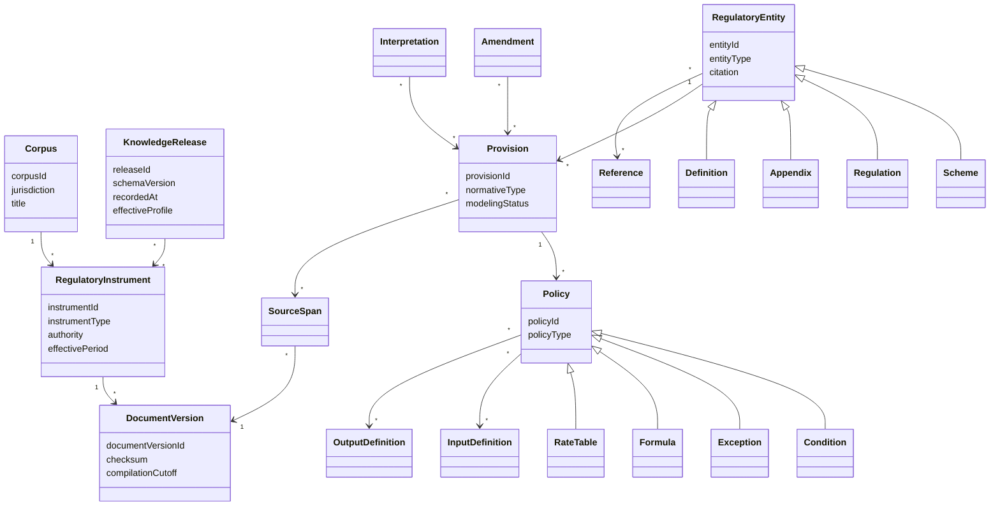
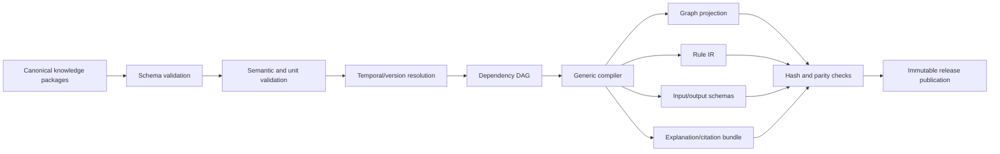
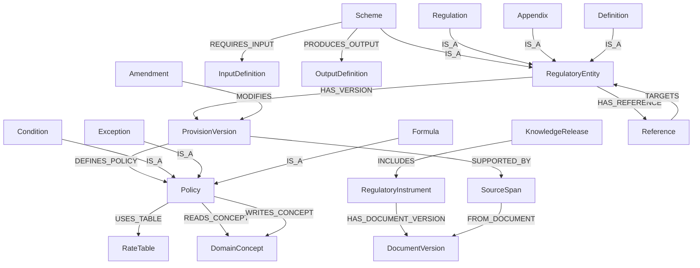

# DCPR Knowledge Engine — Corpus-Scale Architecture V3

**Status:** Recommended architecture  
**Date:** 20 June 2026  
**Initial dataset:** Scheme 33(9)  
**Platform scope:** The complete DCPR corpus across multiple versions and
amendments

## 1. Executive decision

The platform must not be a collection of scheme calculators. It is a
configuration-driven regulatory execution platform.

Every scheme and regulation is represented through one canonical DCPR Knowledge
Model. A generic compiler generates:

- a Neo4j knowledge graph projection;
- an executable rule package;
- input and output contracts;
- source citations;
- validation reports; and
- explanation context.

The runtime contains no branches such as:

```python
if scheme_id == "33(9)":
    ...
elif scheme_id == "33(10)":
    ...
```

Onboarding Scheme 33(7), 33(10), 58, 62, or another provision should normally
require only:

1. source registration;
2. canonical knowledge files;
3. review and validation; and
4. scheme-specific golden scenarios.

Backend code changes are allowed only when the corpus exposes a genuinely new,
reusable language capability, such as a new dimensional quantity or regulatory
operator. Such a capability is added to the platform DSL and becomes available
to every scheme. A scheme-specific code plugin is not permitted.

## 2. Scale assumptions

| Item | Design volume |
|---|---:|
| Schemes/special regulatory paths | 100+ |
| Regulations and sub-regulations | 1,000+ |
| Conditions and exceptions | 5,000+ |
| Explicit references | 10,000+ |
| Source documents and amendments | Many versions over time |
| Graph nodes/relationships | Expected to remain well within Neo4j's normal range |

These volumes do not require distributed infrastructure. They do require strong
identity, modular knowledge packages, deterministic compilation, bounded graph
queries, and effective version selection.

## 3. Corpus-wide architecture

```mermaid
flowchart LR
    subgraph Sources["Legal evidence"]
        PDFs["DCPR PDFs"]
        Notifications["Notifications and amendments"]
        Circulars["Circulars / sanctioned appendices"]
        Decisions["Approved interpretations"]
    end

    subgraph Ingestion["Knowledge acquisition"]
        Extract["Docling / OCR / table extraction"]
        Candidates["Extraction candidates"]
        Reconcile["Entity resolution and amendment reconciliation"]
        Review["Domain review"]
    end

    subgraph Canonical["Canonical DCPR Knowledge Repository — operational SSOT"]
        Registry["Corpus and source registry"]
        Provisions["Versioned provisions"]
        Concepts["DCPR concept registry"]
        Policies["Conditions, exceptions and policies"]
        Formulae["Formulae and rate tables"]
        Contracts["Inputs and outputs"]
        References["References and precedence"]
    end

    subgraph Build["Validation and compilation"]
        Validator["Schema, semantic, temporal and coverage validation"]
        Resolver["Effective-version and dependency resolver"]
        Compiler["Generic knowledge compiler"]
        Release["Immutable knowledge release"]
    end

    subgraph Projections["Generated projections"]
        Graph[("Neo4j graph")]
        Rules["Executable rule IR"]
        Index["Text/source index"]
        Explain["Explanation context"]
    end

    subgraph Runtime["Generic runtime"]
        API["Scheme-agnostic API"]
        Engine["Rule and calculation engine"]
        Trace["Decision and area ledger"]
        Qwen["Qwen explanation only"]
    end

    PDFs --> Extract
    Notifications --> Extract
    Circulars --> Extract
    Decisions --> Review
    Extract --> Candidates --> Reconcile --> Review
    Review --> Registry
    Review --> Provisions
    Review --> Concepts
    Review --> Policies
    Review --> Formulae
    Review --> Contracts
    Review --> References

    Registry --> Validator
    Provisions --> Validator
    Concepts --> Validator
    Policies --> Validator
    Formulae --> Validator
    Contracts --> Validator
    References --> Validator
    Validator --> Resolver --> Compiler --> Release
    Release --> Graph
    Release --> Rules
    Release --> Index
    Release --> Explain

    API --> Engine
    Rules --> Engine
    Graph --> Engine
    Engine --> Trace --> Qwen
    Explain --> Qwen
```



Neo4j and executable rules are sibling projections from the same immutable
release. Neither is authored directly and neither is the source of the other.

## 4. Architectural layers

### 4.1 Evidence layer

Stores immutable source material and exact provenance:

- official instrument identity;
- issuing authority;
- notification number;
- legal effective date;
- compilation cutoff;
- retrieval date;
- file checksum;
- page/block coordinates;
- raw and corrected text;
- OCR confidence.

The upload date of a PDF is not treated as its legal effective date.

### 4.2 Canonical knowledge layer

Stores reviewed regulatory meaning independently of Neo4j, Python, and Qwen.
This layer answers:

- what entities and DCPR concepts exist;
- what a provision states;
- what conditions and exceptions apply;
- what formula or table determines an entitlement;
- what inputs are required;
- what outputs are produced;
- what references and amendments control interpretation; and
- which source spans support every claim.

### 4.3 Compilation layer

Validates and transforms one knowledge release into deterministic projections.
It does not infer new legal meaning.

### 4.4 Runtime layer

Loads a compiled scheme execution plan using `scheme_id`,
`knowledge_release_id`, and `as_of_date`. The engine does not know which scheme
it is evaluating beyond those data identifiers.

### 4.5 Reasoning layer

Qwen receives structured graph facts, outputs, ledgers, trace entries,
assumptions, conflicts, and citations. It cannot execute conditions, perform
calculations, or modify outcomes.

## 5. Canonical DCPR Knowledge Model

The model has a stable corpus-wide meta-model and an extensible DCPR concept
registry.



### 5.1 Stable entity types

The corpus model supports:

```text
SCHEME
REGULATION
SUB_REGULATION
CLAUSE
APPENDIX
ANNEXURE
TABLE
DEFINITION
NOTIFICATION
AMENDMENT
INTERPRETATION
```

These types describe the legal structure. They are distinct from DCPR domain
concepts such as FSI and rehabilitation BUA.

### 5.2 DCPR concept registry

The concept registry includes first-class types for:

```text
FloorSpaceIndex
BuiltUpArea
CarpetArea
PlotArea
AreaBasis
RoadWidth
RoadAccess
RehabilitationComponent
SaleComponent
TenementCount
TenementEntitlement
Reservation
AmenitySpace
IncentiveFSI
PremiumFSI
FungibleCompensatoryArea
TransferableDevelopmentRight
LandRate
ConstructionRate
BasicRatio
Building
Structure
BuildingAge
Occupant
EligibilityEvidence
ConsentRequirement
DevelopmentRight
LandTenure
AuthorityApproval
HeritageConstraint
CRZConstraint
OpenSpace
ParkingRequirement
HeightConstraint
Setback
Premium
DevelopmentCess
```

The registry is extensible through data. Each concept definition declares:

```yaml
concept_type: FloorSpaceIndex
value_type: decimal
unit: ratio
allowed_roles:
  - INPUT
  - DERIVED
  - OUTPUT
validation:
  minimum: "0"
display:
  label: Floor Space Index
```

A new named concept normally requires configuration. Code is needed only for a
new underlying value kind or evaluation operator.

### 5.3 Provision and policy composition

A scheme is an aggregate of references to reusable policies:

```yaml
scheme:
  id: dcpr:scheme:example
  provisions:
    - dcpr:provision:example-applicability
  policy_bindings:
    applicability:
      - dcpr:policy:example-minimum-plot-area
    eligibility:
      - dcpr:policy:example-occupant-eligibility
    calculations:
      - dcpr:formula:example-applicable-fsi
    exceptions:
      - dcpr:exception:example-authority-approval
  input_contract: dcpr:contract:example-inputs
  output_contract: dcpr:contract:development-potential-v1
```

Shared rules such as unit definitions, area treatment, common eligibility
evidence, Regulation 31(3), or Regulation 32 TDR mechanics are modeled once and
referenced by schemes. Scheme-specific bindings supply facts and table IDs.

## 6. Generic structured representation

Every executable scheme uses the same envelope:

```yaml
schema_version: dcpr-knowledge-model/v1

entity:
  id: dcpr:scheme:33-9
  type: SCHEME
  citation: "33(9)"
  effective_period:
    from: YYYY-MM-DD
    to: null
  source_span_ids: []

definitions: []
facts: []
references: []
conditions: []
exceptions: []
formulae: []
rate_tables: []
input_contract: {}
output_contract: {}
interpretations: []
amendments: []
coverage: []
```

Scheme 33(9) uses this envelope, but the envelope contains no 33(9)-specific
field.

### 6.1 Conditions

```yaml
conditions:
  - id: dcpr:condition:example
    phase: APPLICABILITY
    expression:
      all:
        - greater_than_or_equal:
            - input: gross_plot_area
            - fact: minimum_plot_area
        - equals:
            - input: jurisdiction
            - value: GREATER_MUMBAI
    on_unknown: INDETERMINATE
    source_span_ids: []
```

### 6.2 Exceptions

```yaml
exceptions:
  - id: dcpr:exception:example
    trigger:
      equals:
        - input: approval_status
        - value: APPROVED
    effect:
      override:
        target_policy_id: dcpr:condition:example
        result: SATISFIED
    precedence:
      basis: EXPLICIT_SOURCE_OVERRIDE
    source_span_ids: []
```

### 6.3 Formulae

```yaml
formulae:
  - id: dcpr:formula:example
    inputs:
      - fsi_base_area
      - applicable_fsi
    expression:
      multiply:
        - input: fsi_base_area
        - input: applicable_fsi
    output: maximum_fsi_counted_bua
    precision_policy: dcpr:precision:area-default
    source_span_ids: []
```

### 6.4 References

```yaml
references:
  - id: dcpr:reference:example
    from_entity_id: dcpr:scheme:example
    to_entity_id: dcpr:regulation:31-3
    reference_type: DEPENDS_ON
    purpose: AREA_TREATMENT
    required_for_execution: true
    source_span_ids: []
```

## 7. Generic rule language

The engine interprets a versioned, allow-listed expression AST. It never
executes arbitrary Python, JavaScript, Cypher, or model-generated code.

### 7.1 Primitive operator families

| Family | Operators |
|---|---|
| Boolean | `all`, `any`, `not` |
| Comparison | `equals`, `not_equals`, `gt`, `gte`, `lt`, `lte`, `between` |
| Arithmetic | `add`, `subtract`, `multiply`, `divide`, `min`, `max`, `abs` |
| Collections | `contains`, `intersects`, `subset`, `count`, `sum`, `weighted_average` |
| Temporal | `before`, `after`, `on_or_before`, `during`, `age_on_date` |
| Tables | `lookup`, `band_lookup`, `matrix_lookup` |
| Quantities | `convert_unit`, `assert_compatible_unit` |
| Facts | `input`, `fact`, `derived`, `concept`, `policy_result` |
| Decisions | `set_output`, `append_component`, `emit_constraint`, `emit_warning` |

### 7.2 Evaluation phases

Every scheme uses the same ordered phases:

```text
1. INPUT_VALIDATION
2. VERSION_RESOLUTION
3. APPLICABILITY
4. ELIGIBILITY
5. AREA_BASIS
6. ENTITLEMENT
7. CALCULATION
8. EXCEPTION
9. PRECEDENCE_AND_CONFLICT
10. OUTPUT_VALIDATION
11. TRACE_AND_CITATION
```

Policies declare their phase and dependencies. The compiler topologically sorts
the execution plan. There is no scheme-specific orchestration code.

### 7.3 Typed values

```text
Boolean / TriState
Decimal
Integer
String
Date
Enum
Quantity<Unit>
Money<Currency>
Percentage
Area
Length
FSIRatio
EntityReference
List<T>
Record
```

All regulatory arithmetic uses `Decimal`. Units are checked before evaluation.

### 7.4 Extension rule

If a new scheme cannot be represented:

1. document the missing semantic capability;
2. prove it is reusable beyond that scheme;
3. add one generic typed operator or value type;
4. version the DSL;
5. add conformance and migration tests; and
6. model the scheme using that capability.

Do not add `custom_handler`, embedded code, scheme plugins, or untyped
expressions to bypass the DSL.

## 8. Generic compilation pipeline



### 8.1 Compiler responsibilities

- resolve stable IDs and aliases;
- select effective provision versions;
- resolve references;
- expand reusable policy imports;
- type-check expression ASTs;
- validate units and output compatibility;
- detect circular executable dependencies;
- order evaluation phases;
- detect duplicated or conflicting output writers;
- generate graph nodes/edges;
- generate rule IR;
- generate JSON input/output schemas;
- generate source coverage and citation maps;
- produce deterministic hashes.

It does not make legal judgments or synthesize missing rules.

### 8.2 Rule IR

Compiled rules contain only resolved IDs and typed operations:

```yaml
rule_ir_version: dcpr-rule-ir/v1
knowledge_release_id: dcpr2034:release:example
execution_plans:
  dcpr:scheme:33-9:
    required_inputs: []
    ordered_policy_ids: []
    outputs: []
    dependency_hash: sha256:...
```

The calculation engine loads the execution plan by scheme ID. Adding an
execution plan requires no engine code.

## 9. Corpus package organization

```text
knowledge/
├── corpus.yaml
├── schemas/
│   ├── knowledge-model.schema.json
│   ├── expression.schema.json
│   ├── rule-ir.schema.json
│   └── release-manifest.schema.json
├── registries/
│   ├── concepts.yaml
│   ├── units.yaml
│   ├── authorities.yaml
│   ├── aliases.yaml
│   └── precision-policies.yaml
├── instruments/
│   └── dcpr-2034/
│       ├── instrument.yaml
│       ├── document-versions/
│       ├── definitions/
│       ├── regulations/
│       │   ├── 30/
│       │   ├── 31/
│       │   ├── 32/
│       │   ├── 33/
│       │   │   ├── 7/
│       │   │   ├── 9/
│       │   │   └── 10/
│       │   ├── 58/
│       │   └── 62/
│       ├── appendices/
│       ├── tables/
│       ├── amendments/
│       └── interpretations/
├── shared-policies/
│   ├── area-accounting/
│   ├── tdr/
│   ├── premium/
│   ├── eligibility/
│   └── evidence/
├── scenarios/
│   ├── 33-7/
│   ├── 33-9/
│   ├── 33-10/
│   ├── 58/
│   └── 62/
└── releases/
    └── manifests/
```

Files are split by legal ownership and review boundaries, not by runtime
technology.

The existing Scheme 33(9) review draft predates this V3 envelope. Its regulatory
content remains useful, but it must be migrated to the generic package structure
before implementation. The migration must move structure—not copy or reinterpret
legal values.

## 10. Versioning and amendments

### 10.1 Stable identity versus version

```text
entity_id: stable legal identity
version_id: immutable content version
effective_from / effective_to: when the law applies
recorded_at: when the platform learned/approved it
source_document_version_id: evidence version
knowledge_release_id: compiled corpus snapshot
```

Both effective time and recorded time are retained. This supports questions such
as:

- what applied on a historical date; and
- what the system believed at the time a past calculation was performed.

### 10.2 Amendment operations

An amendment is structured as:

```yaml
amendment:
  id: dcpr:amendment:example
  instrument_id: notification:example
  effective_from: YYYY-MM-DD
  operations:
    - operation: REPLACE
      target_provision_id: dcpr:provision:example
      replacement_version_id: dcpr:provision-version:example-v2
```

Supported operations:

```text
ADD
REPLACE
DELETE
RENUMBER
INSERT_BEFORE
INSERT_AFTER
MODIFY_TABLE_CELL
MODIFY_REFERENCE
SUPERSEDE
```

The resolver creates an effective corpus view before graph/rule compilation.
Generated artifacts never apply amendments independently.

### 10.3 Release compatibility

Every calculation records:

```text
knowledge_release_id
corpus_schema_version
rule_ir_version
compiler_version
engine_version
scheme_execution_plan_hash
input_hash
```

Historical results remain reproducible even after later amendments.

## 11. Graph model at corpus scale

Neo4j represents legal structure, dependencies, concepts, and provenance:



In implementation, `Scheme`, `Regulation`, `Appendix`, and `Definition` can
carry a shared `:RegulatoryEntity` label. `Condition`, `Exception`, and `Formula`
can carry `:Policy`.

### 11.1 Graph scaling rules

- unique constraints on stable IDs and version IDs;
- indexes on citation, normalized citation, type, effective period, and release;
- query from an indexed entity ID;
- cap exploratory depth and result count;
- precompute a scheme's dependency closure at release build time;
- never traverse the whole corpus during calculation;
- rebuild only affected projections when possible, while retaining a complete
  deterministic full rebuild;
- use release IDs to prevent cross-version edges.

At the stated size, a single Neo4j instance is adequate. Correct query shape is
more important than sharding.

## 12. Preventing drift and duplicate logic

### 12.1 Graph drift

- Neo4j is read-only to application users.
- Graph Builder is the only writer.
- Every node and edge records `knowledge_release_id` and canonical source ID.
- Projection hashes are compared with the release manifest.
- Nightly or CI rebuild comparison detects unauthorized mutation.

### 12.2 Rule drift

- no rule files are manually edited after compilation;
- rule IR contains canonical source IDs;
- engine refuses graph/rule release mismatch;
- semantic diffs show changed conditions, formulae, tables, and outputs before
  release;
- golden scenarios run against every affected scheme.

### 12.3 Duplicate logic

The validator rejects or warns on:

- repeated literal facts with the same legal meaning;
- formulas with structurally equivalent ASTs that should share a policy;
- multiple active writers for one output without precedence;
- copied rate tables;
- local redefinitions of shared concepts;
- references to text labels where stable IDs exist.

Reusable policies are parameterized:

```yaml
policy_template:
  id: dcpr:shared:minimum-threshold
  parameters:
    - measured_concept
    - threshold_fact
  expression:
    greater_than_or_equal:
      - concept: ${measured_concept}
      - fact: ${threshold_fact}
```

Templates reduce duplication but do not hide source-specific facts or
provenance.

## 13. Scheme onboarding contract

### 13.1 Configuration-only onboarding

A new scheme requires:

1. register authoritative documents and amendments;
2. create stable entity/provision IDs;
3. map every normative clause to a modeling status;
4. define/import domain concepts;
5. define input and output contracts;
6. encode conditions, exceptions, formulae, tables, and references;
7. resolve temporal and precedence conflicts;
8. add golden scenarios and boundary tests;
9. compile and inspect semantic diff;
10. publish a new knowledge release.

No API route, controller, graph query, or evaluator branch is added.

### 13.2 Onboarding acceptance checks

- 100% provision coverage classification;
- zero unresolved decisive references;
- zero executable dependency cycles;
- no untyped formula;
- no unit mismatch;
- no overlapping table bands;
- no duplicate output writer without precedence;
- all required inputs are declared;
- every output is source-backed or explicitly derived;
- golden scenarios pass;
- graph/rule/citation hashes match the release.

### 13.3 Capability-gap policy

Onboarding is blocked—not hacked around—when a provision needs an unsupported
operation. The team either:

- expresses it using existing generic primitives; or
- adds a reviewed reusable DSL capability.

This keeps “minimal code changes” from decaying into hidden scheme-specific
logic.

## 14. Generic API

Routes remain scheme-independent:

```text
POST /calculations
POST /comparisons
POST /reasoning
GET  /entities/{entity_id}
GET  /entities/{entity_id}/graph
GET  /entities/{entity_id}/references
GET  /entities/{entity_id}/amendments
GET  /entities/{entity_id}/conflicts
GET  /entities/{entity_id}/validation
GET  /releases/{release_id}
```

Calculation request:

```json
{
  "scheme_id": "dcpr:scheme:33-9",
  "as_of_date": "YYYY-MM-DD",
  "knowledge_release_id": "optional pinned release",
  "inputs": {}
}
```

The UI obtains the scheme-specific form from the generated input schema. Adding
a scheme therefore does not require a hand-built calculator page.

## 15. Explainability and traceability

Every output is represented as a derivation:

```text
Output
  ← formula/policy
  ← facts and prior derived values
  ← source-backed provision versions
  ← source spans
  ← immutable document checksums
```

Trace entries include:

```text
policy_id
policy_version_id
phase
input/derived values read
operator and result
output changes
exception/precedence action
source_span_ids
knowledge_release_id
```

For FSI and BUA, the engine also emits a typed development-potential ledger:

```text
component
area
FSI equivalent
area basis
FSI treatment
beneficiary
source provision
```

This mechanism is shared by every scheme that produces development potential,
not implemented specifically for 33(9).

## 16. Future ingestion automation

The detailed corpus ingestion, OCR, parser, normalization, validation, and
publication design is defined in the
[DCPR Canonical Knowledge Extraction Pipeline](knowledge-extraction-pipeline-v1.md).

```mermaid
flowchart LR
    PDF["PDF/page images"] --> EX["Layout/OCR extraction"]
    EX --> SEG["Clause/table segmentation"]
    SEG --> ER["Entity and citation resolution"]
    ER --> CAND["Knowledge candidates"]
    CAND --> DIFF["Compare with current canonical model"]
    DIFF --> REVIEW["Reviewer workbench"]
    REVIEW --> PATCH["Canonical model patch"]
    PATCH --> VALIDATE["Full validation and compile"]
```



Automation may suggest:

- provision boundaries;
- citations and target references;
- definition candidates;
- condition ASTs;
- formula and table candidates;
- amendment diffs;
- aliases and duplicate provisions.

Automation may not publish decisive knowledge. Candidate confidence and source
evidence accompany every suggestion. The same canonical schema used for manual
authoring becomes the target format for automated extraction, avoiding a future
architecture rewrite.

## 17. Testing strategy across the corpus

### 17.1 Schema conformance

Every package validates against the same model and expression schemas.

### 17.2 Compiler conformance

One suite verifies every DSL operator, value type, dependency rule, and generated
projection.

### 17.3 Scheme golden scenarios

Each scheme contributes only data-driven scenarios:

```yaml
scenario:
  scheme_id: dcpr:scheme:example
  knowledge_release_id: dcpr:release:example
  inputs: {}
  expected:
    status: SUCCESS
    outputs: {}
    applied_policy_ids: []
```

### 17.4 Impact-based regression

When a shared definition, policy, table, or referenced regulation changes, the
dependency graph identifies every affected scheme and runs their scenarios.

### 17.5 Mutation testing

Automated mutations change operators, thresholds, table cells, date bounds, and
exception precedence. Golden and invariant tests must detect the change.

## 18. Maintainability rules

- stable IDs are never reused;
- display text is not identity;
- one legal fact is defined in one canonical location;
- imports are explicit and acyclic;
- cross-scheme shared logic lives in shared policies;
- scheme packages contain bindings and source-specific policy definitions;
- no business rule in controllers, UI, Cypher, or Qwen prompts;
- no arbitrary code embedded in knowledge;
- every release has semantic diff and impact report;
- generated files are clearly marked and not code-reviewed as authored law;
- canonical files optimize for reviewer comprehension, not runtime speed.

## 19. Delivery sequence

The scalable foundation does not need a months-long platform build.

### Milestone 1 — Corpus kernel and Scheme 33(9)

- canonical schema and registries;
- expression AST and generic evaluator;
- generic compiler;
- 33(9) package and golden scenarios;
- graph and rule projections;
- generic calculation API and generated input form.

### Milestone 2 — Prove zero-code onboarding

Onboard a deliberately different second scheme—preferably 33(7) or 33(10)—using
knowledge files only. Record every capability gap. The architecture is not
proven until the second scheme works without scheme branching.

### Milestone 3 — Shared dependency regulations

Model common definitions and Regulations 30, 31, 32, relevant appendices, and
shared area/TDR/premium policies. Refactor duplicate local facts from early
packages into shared modules.

### Milestone 4 — Corpus ingestion

Batch-register the remaining corpus, classify provision coverage, and onboard in
risk/value order. Introduce extraction automation after the manual review model
is stable.

### Milestone 5 — Operational hardening

Add production publication workflow, access control, durable audit storage,
monitoring, backup/restore, and performance testing.

## 20. Architecture fitness tests

The design is accepted only if these remain true:

1. A new scheme expressible with existing DSL primitives requires no backend
   changes.
2. All graph nodes and executable rules can be regenerated from one canonical
   release.
3. Deleting Neo4j does not lose authored regulatory knowledge.
4. No runtime rule contains an untraceable literal.
5. Every output reaches source spans through canonical IDs.
6. One amendment creates a new effective view without rewriting history.
7. A shared-policy change identifies and tests every affected scheme.
8. UI input forms are generated from scheme contracts.
9. Qwen removal does not affect calculations.
10. Unsupported legal semantics block onboarding rather than trigger custom
    scheme code.

## 21. Final recommendation

Adopt a corpus-first canonical knowledge platform and retain Scheme 33(9) as the
first conformance dataset, not as the architectural center.

The first delivery should build only the smallest generic kernel needed to model
33(9), then immediately onboard a second materially different scheme. That
second onboarding is the decisive scalability test: if it requires backend
branches, the canonical model or DSL is incomplete.
