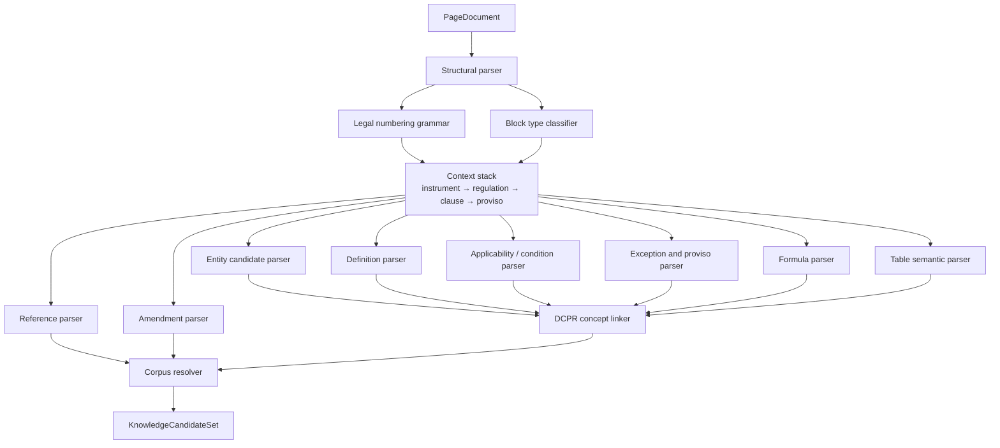
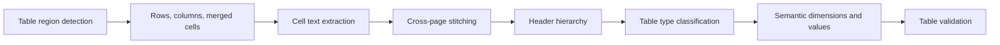
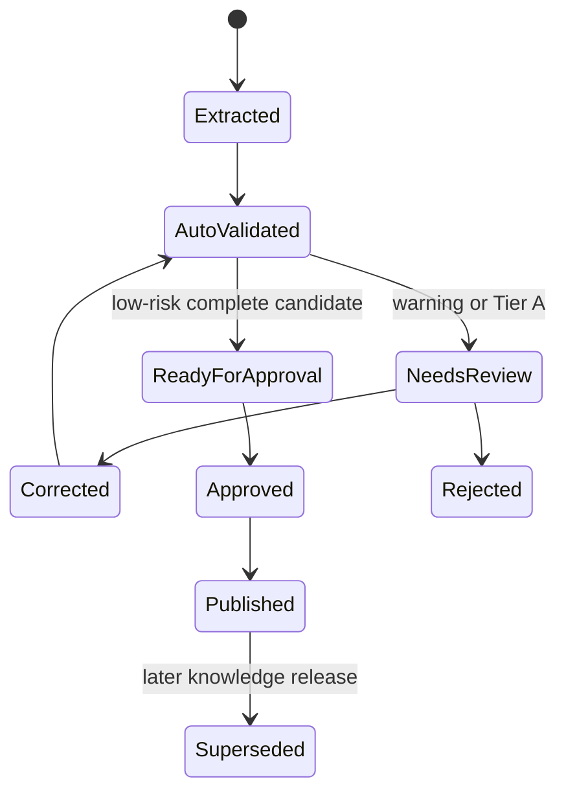

# DCPR Canonical Knowledge Extraction Pipeline

**Status:** Proposed extraction architecture  
**Date:** 20 June 2026  
**Scope:** Entire DCPR corpus, including regulations, schemes, appendices,
annexures, tables, definitions, formulae, references, exceptions, notifications,
and amendments  
**Architecture dependency:** [Corpus-Scale Architecture V3](corpus-scale-architecture-v3.md)

## 1. Objective

The pipeline converts heterogeneous regulatory documents into reviewed,
versioned Canonical DCPR Knowledge Model packages.

For every extracted knowledge object, the pipeline preserves:

- stable identity and immutable version identity;
- title, citation, and regulatory type;
- parent/child legal structure;
- references and resolved targets;
- applicability, conditions, exceptions, and precedence;
- formulae, rate tables, variables, inputs, and outputs;
- definitions and scope;
- amendment/effective-date history;
- source document, PDF page, printed page, bounding box, and source text;
- extraction lineage and multidimensional confidence; and
- validation and review status.

The pipeline does not publish OCR output as law. It produces candidates, resolves
them against the corpus, and requires validation/review before they enter an
approved knowledge release.

## 2. Non-negotiable boundaries

1. PDFs and notifications are legal evidence.
2. Approved canonical YAML, normalized to canonical JSON, is the operational
   source of truth.
3. Neo4j and rule IR are generated projections.
4. Raw, normalized, and corrected source text are stored separately.
5. An LLM may propose structured candidates but may not publish knowledge.
6. No unresolved decisive reference, numeric value, formula, exception, or
   amendment is executable.
7. Every normative source clause receives a coverage classification, including
   clauses that are non-executable or pending review.
8. Re-ingestion creates a new extraction run and semantic diff; it never mutates
   a published release in place.

## 3. Ingestion architecture

```mermaid
flowchart LR
    subgraph Sources["Source acquisition"]
        PDFs["PDFs and scanned PDFs"]
        Notices["Notifications / amendments"]
        Circulars["Circulars / sanctioned appendices"]
        Manual["Reviewer corrections / interpretations"]
    end

    subgraph Evidence["L0 — Immutable evidence"]
        Registry["Source registry"]
        Binary["Original binary + checksum"]
        Images["Rendered page images"]
    end

    subgraph PageIR["L1 — Page and layout IR"]
        Preflight["PDF/page classification"]
        Native["Native text extraction"]
        OCR["Conditional OCR"]
        Layout["Layout and reading order"]
        Tables0["Raw table structures"]
        PageDoc["Unified PageDocument"]
    end

    subgraph StructuralIR["L2 — Legal structural IR"]
        Numbering["Numbering and hierarchy parser"]
        Blocks["Provision blocks"]
        Tables1["Normalized table grid"]
        Footnotes["Notes, provisos and footnotes"]
    end

    subgraph Candidates["L3 — Semantic candidates"]
        Entities["Entity / definition candidates"]
        References["Reference candidates"]
        Policies["Applicability / condition / exception candidates"]
        Formulae["Formula / input / output candidates"]
        Amendments["Amendment operation candidates"]
    end

    subgraph Reconciliation["L4 — Corpus reconciliation"]
        Identity["Stable identity and alias resolution"]
        RefResolve["Cross-reference resolution"]
        Temporal["Amendment and effective-view reconstruction"]
        Concepts["DCPR concept linking"]
        Confidence["Confidence calibration"]
        Diff["Semantic diff against current model"]
    end

    subgraph Canonical["L5 — Canonical publication"]
        Validate["Validation suites"]
        Review["Risk-based human review"]
        YAML["Approved canonical YAML"]
        Release["Immutable knowledge release"]
    end

    PDFs --> Registry
    Notices --> Registry
    Circulars --> Registry
    Manual --> Review
    Registry --> Binary --> Preflight
    Preflight --> Images
    Preflight --> Native
    Preflight --> OCR
    Native --> Layout
    OCR --> Layout
    Layout --> Tables0
    Layout --> PageDoc
    Tables0 --> PageDoc
    PageDoc --> Numbering --> Blocks
    PageDoc --> Tables1
    PageDoc --> Footnotes
    Blocks --> Entities
    Blocks --> References
    Blocks --> Policies
    Blocks --> Formulae
    Tables1 --> Formulae
    Footnotes --> Policies
    Notices --> Amendments
    Entities --> Identity
    References --> RefResolve
    Policies --> Concepts
    Formulae --> Concepts
    Amendments --> Temporal
    Identity --> Diff
    RefResolve --> Diff
    Temporal --> Diff
    Concepts --> Confidence --> Diff
    Diff --> Validate --> Review --> YAML --> Release
```



## 4. Pipeline artifact contract

| Level | Artifact | Purpose | Authoritative? |
|---|---|---|---:|
| L0 | `SourceDocument` and original binary | Immutable legal evidence | Evidence only |
| L1 | `PageDocument` | Text tokens, layout, OCR, tables, coordinates | No |
| L2 | `StructuralDocument` | Legal hierarchy and normalized provision blocks | No |
| L3 | `KnowledgeCandidateSet` | Machine-proposed semantic objects | No |
| L4 | `ReconciledKnowledgeDraft` | Corpus-resolved draft with conflicts/diffs | No |
| L5 | Canonical Knowledge Package | Reviewed operational regulatory meaning | Yes |

No level may overwrite the preceding level. This allows extraction defects,
semantic parser defects, and reviewer corrections to be distinguished and
replayed.

## 5. PDF processing pipeline

### 5.1 Source registration

Before parsing, register:

```text
instrument identity
document version identity
issuing authority
source URL or acquisition channel
notification number
document title
declared effective date
declared compilation cutoff
retrieval timestamp
file SHA-256
MIME type
page count
language/script hints
legal currency status
relationship to prior document versions
```

URL recency must not be used as legal recency. A newly uploaded PDF may be an old
compilation.

### 5.2 Document preflight

Classify each page independently:

```text
BORN_DIGITAL
SCANNED
HYBRID
TEXT_LAYER_UNRELIABLE
IMAGE_ONLY_TABLE
CORRUPT_OR_UNREADABLE
```

Checks include:

- readable/corrupt/encrypted PDF;
- page dimensions and rotation;
- presence and quality of a text layer;
- text-to-image coverage;
- font encoding anomalies;
- repeated headers/footers/watermarks;
- blank or duplicate pages;
- raster resolution;
- language/script detection;
- suspicious text order;
- native text versus visible glyph mismatch.

### 5.3 Page rendering

Render every page to a stable image representation for provenance and review.
Use a standard target resolution, typically 300–400 DPI for OCR, while
preserving the original page dimensions and transformation matrix.

Store both:

- PDF coordinates; and
- normalized top-left coordinates in `[0,1]`.

This prevents bounding boxes from becoming invalid when a reviewer uses a
different rendering resolution.

### 5.4 Native extraction and layout analysis

For born-digital pages:

- extract glyphs/words with positions and font metadata;
- reconstruct lines and reading order;
- detect headings, lists, paragraphs, captions, tables, footnotes, and formula
  regions;
- retain the native text stream even when normalized reading order differs.

Docling is the preferred layout-aware document adapter because its current
document representation supports page layout, reading order, tables, and formula
elements. It remains an adapter, not the canonical schema.

### 5.5 Unified PageDocument

Normalize all extractor outputs into one internal structure:

```yaml
page:
  document_version_id: "..."
  pdf_page_number: 188
  printed_page_label: "171"
  classification: BORN_DIGITAL
  width: 612
  height: 792
  blocks: []
  tables: []
  tokens: []
  reading_order: []
  extraction_warnings: []
```

All later parsers consume `PageDocument`, not Docling-, OCR-, or PDF-library
specific objects.

## 6. OCR handling

### 6.1 Conditional OCR policy

Do not OCR every page blindly.

| Page state | Primary text | Secondary check |
|---|---|---|
| Reliable born-digital | Native text | OCR only on suspicious regions |
| Scanned | OCR | Optional second OCR engine for decisive/low-confidence regions |
| Hybrid | Region-based native/OCR merge | Conflict comparison |
| Unreliable encoding | OCR | Native text retained as alternate evidence |

### 6.2 Image preparation

Before OCR:

- correct page orientation;
- deskew;
- remove border/shadow noise;
- normalize contrast without erasing punctuation;
- retain an untouched page image;
- crop regions only with a reversible page transform;
- select language packs for English and Marathi/Devanagari where required.

### 6.3 Token-level evidence

Store for each token:

```text
text
normalized text
bounding box
line/block ID
OCR engine and version
language/script
word confidence
alternate recognition candidates
native-text equivalent, if available
```

Tesseract hOCR/TSV can expose word coordinates and confidence. Those values are
engine-specific signals, not calibrated legal confidence.

### 6.4 Regulatory OCR risk detector

Automatically flag:

- `0/O`, `1/l/I`, `5/S`, and `8/B`;
- decimal point loss or insertion;
- `%`, `/`, `+`, `-`, `×`, `≤`, and `≥` corruption;
- `m`, `m²`, `sq. m`, `ha`, and currency unit corruption;
- clause punctuation such as `33(9)(A)` becoming `33(9A)` or `339`;
- dropped negation: `not`, `no`, `unless`, `except`;
- changed modal verbs: `shall`, `may`, `must`;
- changed dates and year cutoffs;
- split/merged table cells;
- superscript/subscript loss;
- OCR disagreement on a threshold, formula, or reference.

Any flagged decisive token requires visual review or agreement from an
independent extraction path.

### 6.5 Text layers

Each source span stores:

```text
native_text
ocr_text
raw_selected_text
normalized_text
corrected_text
correction_reason
```

`corrected_text` never replaces the raw evidence. Corrections are versioned and
reviewed.

## 7. Parser architecture



### 7.1 Deterministic-first parsing

Use deterministic grammars first for:

- numbering and citation syntax;
- headings and hierarchy;
- explicit reference phrases;
- definition markers;
- exception/proviso markers;
- units, dates, percentages, currencies, and comparison operators;
- common formula language;
- amendment operation phrases.

Statistical or LLM-assisted parsing is used for ambiguous scope and semantic AST
suggestions. Its output remains a candidate with extraction lineage.

### 7.2 Context stack

The parser maintains:

```text
current instrument
part/chapter
regulation
sub-regulation
clause/sub-clause/item
appendix/annexure
table
proviso/explanation/note
```

This is essential for resolving relative references such as:

- “this Regulation”;
- “the above clause”;
- “sub-clause (b)”;
- “the said Table”;
- “provided further that”.

### 7.3 Stable identity

Stable IDs use legal identity, not page number or content hash:

```text
dcpr:2034:regulation:33
dcpr:2034:regulation:33:subregulation:9
dcpr:2034:regulation:33:subregulation:9:clause:6:b
dcpr:2034:regulation:33:subregulation:9:table:b
```

Each content/effective version receives a separate `version_id`.

Identity generation rules:

- normalize Arabic/Roman numerals without losing printed form;
- preserve nested clause path;
- preserve the original printed citation;
- maintain aliases for renumbered or inconsistently printed citations;
- detect duplicate claims on the same stable identity;
- never silently assign suffixes to resolve duplicates;
- create a provisional ID when hierarchy is uncertain and block publication.

## 8. Table extraction

### 8.1 Table pipeline



Docling's table structure should be the primary adapter. A second table
recognizer may be applied to low-confidence or image-only tables. The canonical
table object must not depend on either tool's native format.

### 8.2 Raw table preservation

Store:

- table bounding box and caption;
- page range;
- row/column count;
- row/column spans;
- every cell's raw text and source span;
- detected header hierarchy;
- repeated page headers;
- notes and footnotes;
- extraction method and confidence.

### 8.3 Semantic table types

Classify tables as:

```text
RATE_MATRIX
THRESHOLD_BANDS
ALLOCATION_TABLE
AREA_STANDARD
PARKING_STANDARD
USE_PERMISSION_MATRIX
FEE_OR_PREMIUM_TABLE
SCHEDULE
DEFINITION_TABLE
REFERENCE_INDEX
OTHER
```

### 8.4 Table normalization

For executable tables:

- identify dimension names;
- normalize ranges to explicit inclusive/exclusive bounds;
- normalize units;
- convert percentages to decimal-safe values while preserving printed text;
- identify output concept;
- bind each cell to row/column dimension members;
- preserve blank, dash, `N/A`, and “not permissible” as different values;
- link footnotes/provisos to affected cells or bands.

### 8.5 Table validation

- rectangular grid after span expansion;
- unique dimension keys;
- complete matrix where legally expected;
- no overlapping numeric bands;
- no unintended gaps;
- lower bound not greater than upper bound;
- percentages/totals satisfy stated invariants;
- units are dimensionally compatible;
- every executable value has a cell source span;
- continued tables have matching headers and sequence;
- competing extraction engines agree on decisive cells or trigger review.

## 9. Cross-reference detection

### 9.1 Reference candidate patterns

Detect references to:

```text
Regulation / sub-regulation / clause / proviso
Appendix / annexure / schedule / table
Definition or defined term
Notification / Government Resolution / circular
Act / rule / external code
Figure / map / Development Plan designation
Relative reference within the current hierarchy
```

Store the exact mention separately from its normalized target citation.

### 9.2 Resolution pipeline

1. Parse mention into citation components.
2. Apply current context for relative references.
3. Normalize aliases and historical numbering.
4. Restrict candidates by instrument, effective period, and entity type.
5. Rank exact citation, scoped citation, title, and alias matches.
6. Resolve only when one candidate satisfies the policy.
7. Otherwise store `AMBIGUOUS` or `UNRESOLVED` with candidate IDs.

### 9.3 Reference semantics

Separate textual citation from inferred execution dependency:

```text
REFERENCES
DEFINES
DEPENDS_ON
USES_TABLE
USES_FORMULA
SUBJECT_TO
EXCEPT_AS_PROVIDED_BY
OVERRIDES
AMENDS
SUPERSEDES
```

An explicit textual `REFERENCES` edge may be auto-detected. Stronger semantics
such as `OVERRIDES` or executable `DEPENDS_ON` require source language or
reviewed interpretation.

### 9.4 Reference validation

- target exists in the effective corpus view;
- target type matches the mention;
- decisive references are uniquely resolved;
- target effective period is compatible;
- referenced table/formula is executable if required;
- circular textual references are reported;
- circular executable dependencies block compilation;
- relative references retain their resolution context.

## 10. Formula extraction

### 10.1 Formula sources

Formulae may appear as:

- displayed mathematical expressions;
- inline expressions;
- table semantics;
- prose such as “A divided by B”;
- entitlement statements such as “X percent of Y”;
- alternatives such as “whichever is more/less”;
- caps/floors such as “not exceeding” or “subject to a minimum”;
- allocation equations;
- location/value-adjustment equations.

### 10.2 Formula candidate representation

Preserve both:

```text
raw expression/source text
normalized typed expression AST
```

The AST uses the corpus-wide allow-listed rule language:

```yaml
expression:
  op: MAX
  args:
    - kind: FACT
      id: dcpr:fact:example-floor
    - op: ADD
      args:
        - kind: DERIVED
          id: rehabilitation_fsi
        - kind: DERIVED
          id: incentive_fsi
```

### 10.3 Variable and concept binding

Every symbol/phrase is bound to:

- canonical concept ID;
- value type;
- unit;
- input, fact, or derived role;
- defining provision;
- aliases used in source text.

Unbound variables block executable status.

### 10.4 Formula validation

- expression AST is syntactically valid;
- all operators are allow-listed;
- all variables are declared;
- units are compatible;
- result type matches output;
- no division by zero path is unhandled;
- precision and rounding policies are explicit;
- lookup tables exist and have compatible dimensions;
- floors, caps, and boundary inclusivity match source text;
- formula dependencies are acyclic;
- raw text and normalized AST are reviewed together;
- numeric literals have direct source evidence or reference named facts.

## 11. Definition extraction

### 11.1 Definition markers

Detect:

- “X means...”;
- “X shall mean...”;
- “for the purposes of this Regulation, X...”;
- “X includes...”;
- “X does not include...”;
- “X shall have the same meaning as...”;
- explanation clauses that establish terminology.

### 11.2 Definition model

Extract:

```text
defined term
normalized term
definition text
definition kind
scope
aliases/abbreviations
included concepts
excluded concepts
external definition reference
effective period
source spans
```

Scope values:

```text
CORPUS
INSTRUMENT
PART
REGULATION
SCHEME
CLAUSE
TABLE
```

### 11.3 Definition validation

- one active definition per term/scope/effective period unless conflict is
  explicit;
- local definitions shadow wider definitions only in their declared scope;
- referenced external definition resolves;
- circular definition chains are reported;
- acronym expansions are consistent;
- definition changes are linked to amendments;
- concept linkage does not discard the exact legal text.

## 12. Applicability and condition extraction

### 12.1 Applicability

Applicability identifies the regulated subject and scope:

```text
jurisdiction/location
plot or cluster characteristics
building/structure class
ownership or tenure
scheme/operator/authority
date or age condition
land use/zone/reservation
minimum/maximum area
road/access requirement
exclusion from another scheme
```

Applicability is modeled as a policy with a typed expression and an
`on_unknown` outcome.

### 12.2 Condition language

Detect:

```text
if
where
when
provided that
subject to
only if
on condition that
shall be permissible where
not less than / more than / up to
before / after / as on
```

Conditions are classified by evaluation phase:

```text
APPLICABILITY
ELIGIBILITY
AREA_BASIS
ENTITLEMENT
CALCULATION
CONSTRAINT
PROCEDURAL
```

Procedural conditions may remain non-executable while still being canonical
knowledge.

## 13. Exception detection

### 13.1 Exception/proviso markers

Detect:

```text
notwithstanding
except
unless
provided that
provided further that
however
save as
subject to
in specific cases
with special permission
at the discretion of
```

“Provided that” is not automatically an exception. It may be a condition,
qualification, cap, floor, procedure, or true override.

### 13.2 Exception classification

```text
OVERRIDE
EXCLUSION
QUALIFICATION
ALTERNATIVE
PERMISSION
PROHIBITION
CAP
FLOOR
AUTHORITY_DISCRETION
PROCEDURAL_PROVISO
```

### 13.3 Exception structure

Each exception has:

- trigger expression;
- target policy/provision;
- effect type;
- replacement/modified value or policy;
- precedence basis;
- authority approval requirement;
- scope and effective period;
- source evidence.

If target scope cannot be identified, the exception remains non-executable and
creates a blocker for affected outputs.

## 14. Amendment detection

### 14.1 Source distinction

Treat these differently:

- original sanctioned instrument;
- amendment notification;
- corrigendum/addendum;
- consolidated compilation;
- circular/guideline;
- court/government interpretation;
- draft or proposed modification.

A consolidated PDF is useful evidence but does not replace the amendment chain.

### 14.2 Amendment markers

Detect phrases such as:

```text
shall be substituted
shall be deleted
shall be added
shall be inserted
for the words ... substitute
after clause ... insert
renumbered as
entire regulation is replaced
shall come into force
with effect from
```

### 14.3 Structured operations

```text
ADD
REPLACE
DELETE
RENUMBER
INSERT_BEFORE
INSERT_AFTER
MODIFY_TABLE_CELL
MODIFY_REFERENCE
SUPERSEDE
CORRECT_TYPO
```

Every operation records:

- amending instrument/version;
- target stable ID and target version;
- operation payload;
- notification/publication/effective dates;
- source spans for instruction and replacement text;
- resolution status;
- reviewer decision.

### 14.4 Temporal reconstruction

The amendment resolver:

1. identifies the base instrument/version;
2. applies operations in legal effective order;
3. detects overlapping or contradictory amendments;
4. preserves renumbering aliases;
5. emits immutable provision versions;
6. constructs an effective corpus view for a requested date;
7. compares consolidated copies against the reconstructed view;
8. flags unexplained differences.

Both effective time and recorded/knowledge time are retained.

## 15. Confidence model

One average confidence score is insufficient. Store:

```text
text_confidence
layout_confidence
structure_confidence
semantic_type_confidence
scope_confidence
numeric_confidence
table_structure_confidence
formula_confidence
reference_resolution_confidence
amendment_resolution_confidence
overall_candidate_confidence
```

### 15.1 Confidence rules

- confidence values range from 0 to 1;
- retain the extractor/model and calibration version;
- model self-confidence is never used directly;
- decisive confidence is limited by the weakest decisive dimension;
- reviewer verification is a separate status, not `1.0` confidence;
- extraction agreement can raise confidence only when paths are independent;
- source conflict always overrides a high extraction score;
- confidence thresholds are calibrated against a labeled DCPR validation set.

### 15.2 Risk tiers

| Tier | Content | Review policy |
|---|---|---|
| A | Thresholds, dates, negation, formulae, table cells, exceptions, amendments, decisive references | Mandatory review |
| B | Definitions, applicability scope, entity hierarchy, non-decisive references | Review or controlled bulk approval |
| C | Non-normative explanatory text and discoverability metadata | Sampling may be sufficient |

## 16. Validation rules

### 16.1 Evidence validation

- source checksum exists and is immutable;
- every source span references a valid document/page;
- bounding boxes lie within the page;
- source text is non-empty for normative objects;
- corrections preserve raw text and review metadata;
- decisive objects have page-image evidence.

### 16.2 Structural validation

- legal hierarchy is acyclic;
- parent types are valid;
- numbering gaps/duplicates are reported;
- printed and normalized citations are retained;
- orphan provisions are blocked or explicitly classified;
- appendix/table continuations are complete;
- every normative source block has a coverage record.

### 16.3 Identity validation

- stable IDs are unique within the corpus;
- version IDs are immutable and unique;
- duplicate citation/effective windows are conflicts;
- renumbering creates aliases, not duplicate entities;
- content hashes do not replace legal identity.

### 16.4 Semantic validation

- object type is allowed;
- definitions have scope;
- applicability/conditions use typed concepts;
- exceptions identify target and effect;
- inputs and outputs are declared;
- every derived output has a producing policy;
- no two equal-precedence policies write incompatible values;
- domain concepts and units exist in registries.

### 16.5 Reference validation

- target resolution status is explicit;
- decisive references resolve uniquely;
- required targets exist in the effective release;
- target type/effective period are compatible;
- executable dependency graph is acyclic.

### 16.6 Table and formula validation

- table grid and semantic dimensions are valid;
- bands are complete/non-overlapping where required;
- formula variables and outputs are typed;
- dimensional analysis passes;
- precision/rounding are explicit;
- decisive literals are evidence-backed named facts.

### 16.7 Temporal/amendment validation

- effective periods are valid;
- active versions do not overlap unexpectedly;
- amendment target and base version resolve;
- supersession/renumbering chains are acyclic;
- consolidated text differences are explained by amendments or findings;
- future-dated provisions are not activated early.

### 16.8 Publication validation

An executable release requires:

- no blocker finding;
- no unresolved decisive reference;
- no unresolved decisive source conflict;
- no unreviewed Tier A object;
- 100% normative coverage classification;
- all execution plans compile;
- graph/rule/source hashes agree;
- reviewer approvals are present.

## 17. Review workflow



The review UI should show:

- page image and highlighted source span;
- raw/native/OCR/corrected text;
- extracted canonical object;
- parser rationale and alternatives;
- related references and existing canonical entities;
- semantic diff;
- validation findings;
- downstream schemes/outputs affected.

## 18. Canonical Knowledge Model schema

The formal YAML-encoded JSON Schema is:

- [Canonical Knowledge Model Schema](../knowledge/schemas/canonical-knowledge-model.schema.yaml)

The top-level package contains:

```yaml
schema_version: dcpr-knowledge-model/v1
package: {}
source_documents: []
source_spans: []
entities: []
definitions: []
facts: []
references: []
applicability: []
conditions: []
exceptions: []
formulae: []
tables: []
inputs: []
outputs: []
amendments: []
interpretations: []
coverage: []
findings: []
approvals: []
```

### 18.1 Required extraction fields

| Required field | Canonical location |
|---|---|
| Unique identifier | `*.id` and entity `version_id` |
| Title | `entities[].title` |
| Type | `entities[].type` or object-specific `type` |
| References | `references[]` and entity semantic links |
| Conditions | `conditions[]` |
| Exceptions | `exceptions[]` |
| Formulae | `formulae[]` |
| Definitions | `definitions[]` |
| Applicability | `applicability[]` |
| Inputs | `inputs[]` |
| Outputs | `outputs[]` |
| Source page | `source_spans[].pdf_page_number` and `printed_page_label` |
| Source text | raw/normalized/corrected fields in `source_spans[]` |
| Confidence score | object `confidence` plus source-span confidence |

### 18.2 Extraction lineage

Every canonical object records evidence and lineage:

```yaml
evidence:
  source_span_ids:
    - dcpr:source-span:...
  extraction_run_id: dcpr:extraction-run:...
  extraction_method: DETERMINISTIC_AND_REVIEWED
  candidate_id: dcpr:candidate:...

confidence:
  text: 0.99
  structure: 0.97
  semantic: 0.88
  numeric: 1.0
  overall: 0.88
  scoring_method: weakest-decisive-dimension/v1
  review_status: VERIFIED
```

## 19. Neo4j mapping strategy

Neo4j is compiled from an approved canonical release.

### 19.1 Node mapping

| Canonical collection | Neo4j labels |
|---|---|
| `package` | `KnowledgeRelease` |
| `source_documents` | `RegulatoryInstrument`, `DocumentVersion` |
| `source_spans` | `SourceSpan` |
| `entities` | `RegulatoryEntity` plus `Scheme`, `Regulation`, `Clause`, `Appendix`, `Annexure`, `Table`, or `Definition` |
| `definitions` | `DefinitionPolicy` |
| `facts` | `RegulatoryFact`, plus domain concept label where useful |
| `applicability` | `ApplicabilityPolicy` |
| `conditions` | `ConditionPolicy` |
| `exceptions` | `ExceptionPolicy` |
| `formulae` | `FormulaPolicy` |
| `tables` | `RegulatoryTable`, `TableBand`, `TableCell` |
| `inputs` | `InputDefinition` |
| `outputs` | `OutputDefinition` |
| `amendments` | `Amendment`, `AmendmentOperation` |
| `interpretations` | `Interpretation` |
| `findings` | `ValidationFinding` |

### 19.2 Relationship mapping

```text
KnowledgeRelease -[:INCLUDES]-> RegulatoryEntity
RegulatoryInstrument -[:HAS_DOCUMENT_VERSION]-> DocumentVersion
DocumentVersion -[:HAS_SPAN]-> SourceSpan
RegulatoryEntity -[:HAS_VERSION]-> ProvisionVersion
RegulatoryEntity -[:CONTAINS]-> RegulatoryEntity
CanonicalObject -[:SUPPORTED_BY]-> SourceSpan
RegulatoryEntity -[:HAS_REFERENCE]-> Reference
Reference -[:TARGETS]-> RegulatoryEntity
RegulatoryEntity -[:HAS_APPLICABILITY]-> ApplicabilityPolicy
RegulatoryEntity -[:HAS_CONDITION]-> ConditionPolicy
RegulatoryEntity -[:HAS_EXCEPTION]-> ExceptionPolicy
RegulatoryEntity -[:USES_FORMULA]-> FormulaPolicy
FormulaPolicy -[:USES_TABLE]-> RegulatoryTable
Policy -[:READS_CONCEPT]-> DomainConcept
Policy -[:WRITES_CONCEPT]-> DomainConcept
RegulatoryEntity -[:REQUIRES_INPUT]-> InputDefinition
RegulatoryEntity -[:PRODUCES_OUTPUT]-> OutputDefinition
Amendment -[:MODIFIES]-> ProvisionVersion
ExceptionPolicy -[:OVERRIDES]-> Policy
```

### 19.3 Mapping rules

- use canonical IDs as Neo4j identity keys;
- add `knowledge_release_id` to every projected node/edge;
- keep full expression AST and long source text in canonical artifacts; graph
  nodes store hashes/summary fields and links;
- create `TableCell` nodes only for executable or individually referenced cells;
- project unresolved references as findings/candidate targets, never false
  `TARGETS` edges;
- preserve explicit textual references separately from inferred dependencies;
- do not store extraction candidates in the published regulatory graph;
- rebuild projections rather than patching them manually.

## 20. Rule engine mapping strategy

Only approved executable canonical objects are compiled.

| Canonical object | Rule IR result |
|---|---|
| `applicability` | Applicability policies in `APPLICABILITY` phase |
| `conditions` | Typed predicates in declared evaluation phase |
| `exceptions` | Trigger, target, effect, and precedence operations |
| `formulae` | Typed arithmetic/table lookup operations |
| `tables` | Immutable lookup tables with explicit band boundaries |
| `facts` | Named typed constants; no untraceable runtime literals |
| `inputs` | Generated input schema and required-input preflight |
| `outputs` | Output schema, producer binding, and validation |
| executable `references` | Dependency edges between policies/entities |
| `definitions` | Concept aliases, scope, and value normalization where executable |

### 20.1 Compilation process

1. Select the effective canonical view.
2. Exclude `PENDING_REVIEW`, `CONFLICT`, and non-executable objects.
3. Resolve imports and executable references.
4. Bind concepts, facts, inputs, and outputs.
5. Type-check expression ASTs.
6. Validate dimensions, precision, and table lookup domains.
7. Apply explicit exception/precedence relationships.
8. Build and topologically sort the policy dependency graph.
9. Reject cycles and duplicate writers.
10. Generate an execution plan per scheme/regulatory path.
11. Embed canonical IDs and source-span IDs in trace metadata.
12. Hash the rule package and bind it to the knowledge release.

### 20.2 Non-executable knowledge

Procedural requirements, narrative obligations, authority discretion that cannot
be deterministically evaluated, and unresolved interpretations remain in the
canonical model and Neo4j. The compiler marks them as compliance notes or manual
checks; it does not invent boolean rules.

## 21. Corpus processing and incremental ingestion

### 21.1 Batch strategy

Parallelize:

- document download/registration;
- page rendering;
- native extraction/OCR;
- page layout parsing;
- local structural candidate extraction.

Serialize or centrally reconcile:

- stable identity assignment;
- cross-document references;
- aliases/renumbering;
- amendment chains;
- effective corpus views;
- canonical publication.

### 21.2 Incremental strategy

Content hashes allow reprocessing only:

- changed documents;
- changed pages/blocks;
- objects supported by changed spans;
- references targeting changed identities;
- schemes depending on changed policies.

Every incremental build must remain equivalent to a clean full rebuild.

### 21.3 Corpus observability

Track:

```text
documents/pages processed
native/OCR/hybrid page ratios
low-confidence decisive tokens
provisions by coverage state
unresolved/ambiguous references
unreviewed Tier A objects
table/formula validation failures
amendment conflicts
objects changed per ingestion run
review throughput and correction rate
affected schemes per semantic change
```

## 22. Recommended extraction sequence

1. Register all known DCPR documents, notifications, and compilations.
2. Build the page/layout IR for the complete corpus.
3. Establish numbering hierarchy and source coverage before semantic
   extraction.
4. Extract definitions and references early; they improve later concept and
   formula resolution.
5. Extract tables and formulae with cell/token-level provenance.
6. Extract applicability, conditions, and exceptions using the legal context
   stack.
7. Reconstruct amendment chains before declaring any provision current.
8. Resolve stable identities and aliases across versions.
9. Review decisive and low-confidence candidates.
10. Publish canonical releases, then generate Neo4j and rule projections.

## 23. Acceptance criteria

The extraction pipeline is ready for corpus use when:

1. every page can be traced from source checksum to page/layout IR;
2. every normative block has a coverage status;
3. every canonical object has stable ID, evidence, lineage, and confidence;
4. decisive numbers, formulae, exceptions, and amendments are visually
   reviewable;
5. tables preserve cells, headers, bands, notes, and source coordinates;
6. references resolve across documents and effective versions;
7. amendment reconstruction can explain consolidated-version changes;
8. canonical YAML validates against the shared schema;
9. graph and rule artifacts are reproducibly generated from one release;
10. adding a document version requires ingestion/configuration, not parser
    branches specific to a regulation.

## 24. Technical basis

The design uses Docling as an adaptable page/layout extraction layer because its
official documentation describes structured representations for reading order,
tables, and formula-related document elements. Tesseract hOCR/TSV is suitable as
an OCR adapter when word coordinates/confidence are required. For difficult
image tables, an alternate structure recognizer can provide an independent
candidate, but no vendor-specific output enters the canonical model directly.

References:

- [Docling documentation](https://docling-project.github.io/docling/)
- [Docling project](https://www.docling.ai/)
- [Tesseract command-line output formats](https://tesseract-ocr.github.io/tessdoc/Command-Line-Usage.html)
- [PaddleX table structure recognition](https://paddlepaddle.github.io/PaddleX/3.4/en/module_usage/tutorials/ocr_modules/table_structure_recognition.html)
