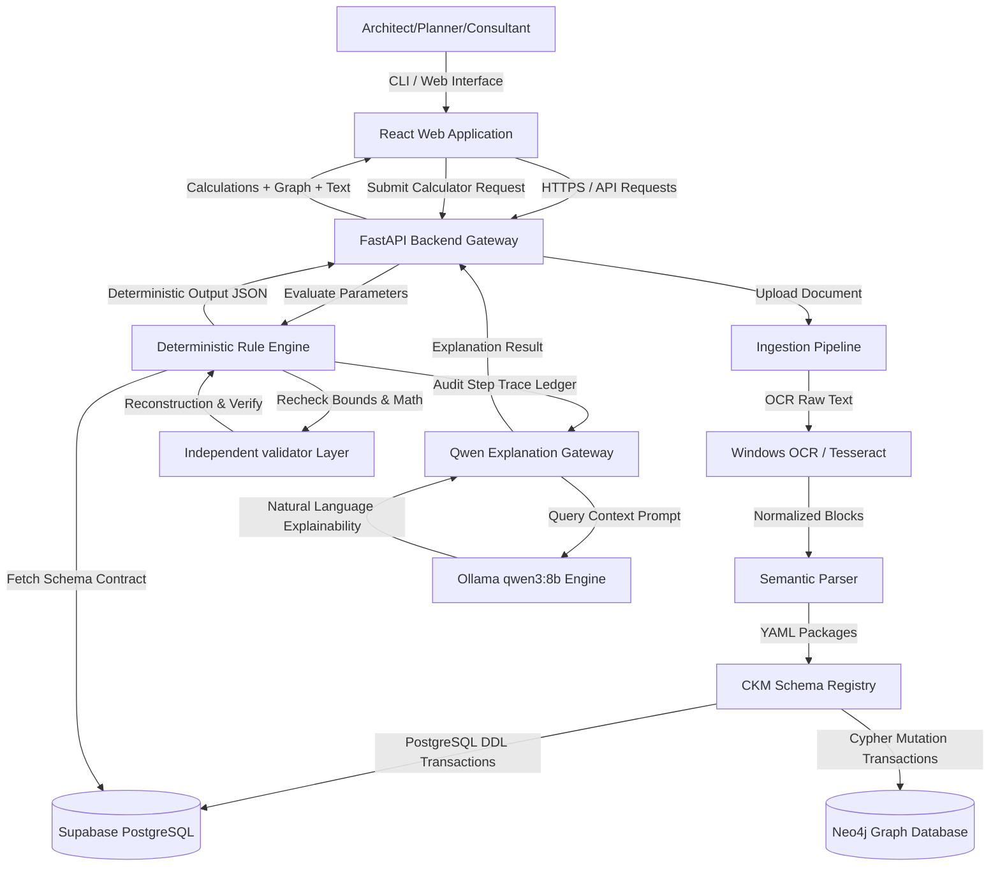
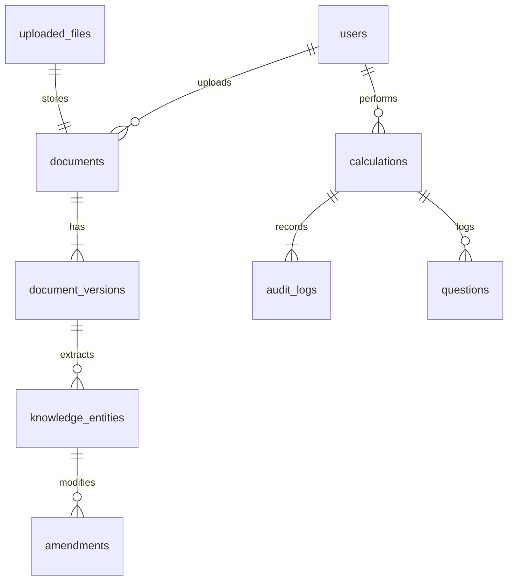
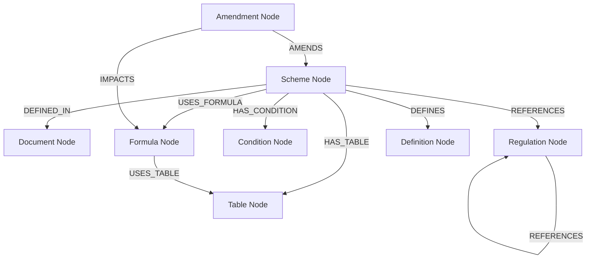
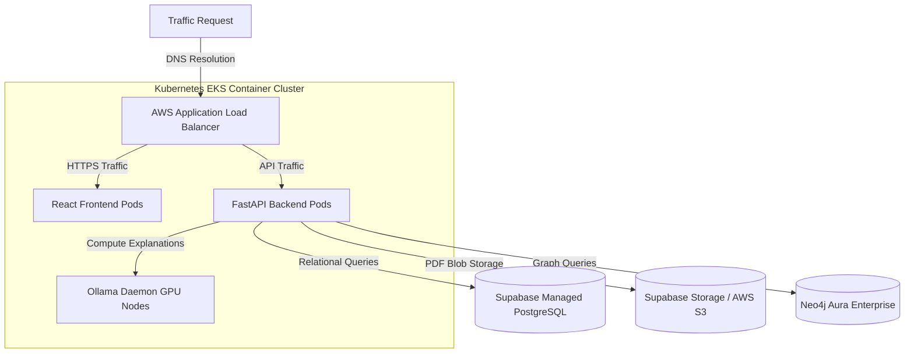

# DCPR Knowledge Platform - Production System Architecture Specification

This document defines the system architecture, database schemas, API contracts, deployment configurations, and roadmaps for the enterprise-grade Mumbai DCPR 2034 Knowledge Platform.

---

## 1. Product Architecture & Component Flow

The platform utilizes a decoupled, asynchronous, event-driven data flow. Calculations are strictly isolated from LLMs to ensure deterministic mathematical outputs. LLMs are used solely as translation gateways to explain traces, compare rules, and compile natural language summaries.



---

## 2. Supabase / Relational Database Schema

The database uses PostgreSQL (managed via Supabase). It stores user profiles, documents, versioning logs, calculations, audit records, and temporal fact/formula lineages.

### 2.1 Entity Relationship Diagram



### 2.2 SQL Migrations (DDL)

```sql
-- Migration: 001_initialize_platform_schema.sql
-- Description: Sets up PostgreSQL relational tables for the DCPR platform.

CREATE EXTENSION IF NOT EXISTS "uuid-ossp";

-- 1. Users Table
CREATE TABLE users (
    id UUID PRIMARY KEY DEFAULT uuid_generate_v4(),
    email VARCHAR(255) UNIQUE NOT NULL,
    full_name VARCHAR(255),
    role VARCHAR(50) DEFAULT 'PLANNER' CHECK (role IN ('ADMIN', 'ARCHITECT', 'PLANNER', 'REGULATOR')),
    created_at TIMESTAMP WITH TIME ZONE DEFAULT CURRENT_TIMESTAMP,
    updated_at TIMESTAMP WITH TIME ZONE DEFAULT CURRENT_TIMESTAMP
);

-- 2. Uploaded Files Storage Metadata
CREATE TABLE uploaded_files (
    id UUID PRIMARY KEY DEFAULT uuid_generate_v4(),
    storage_bucket VARCHAR(100) NOT NULL,
    storage_path VARCHAR(512) UNIQUE NOT NULL,
    file_name VARCHAR(255) NOT NULL,
    file_size_bytes BIGINT NOT NULL,
    mime_type VARCHAR(100),
    sha256_checksum VARCHAR(64) UNIQUE NOT NULL,
    created_at TIMESTAMP WITH TIME ZONE DEFAULT CURRENT_TIMESTAMP
);

-- 3. Documents Table
CREATE TABLE documents (
    id UUID PRIMARY KEY DEFAULT uuid_generate_v4(),
    title VARCHAR(255) NOT NULL,
    document_type VARCHAR(50) NOT NULL CHECK (document_type IN ('DCPR', 'CIRCULAR', 'AMENDMENT', 'NOTIFICATION', 'ORDER')),
    uploaded_by UUID REFERENCES users(id) ON DELETE SET NULL,
    file_id UUID REFERENCES uploaded_files(id) ON DELETE CASCADE,
    created_at TIMESTAMP WITH TIME ZONE DEFAULT CURRENT_TIMESTAMP
);

-- 4. Document Versions (Lineage and Processing Status)
CREATE TABLE document_versions (
    id UUID PRIMARY KEY DEFAULT uuid_generate_v4(),
    document_id UUID REFERENCES documents(id) ON DELETE CASCADE,
    version_tag VARCHAR(50) NOT NULL,
    effective_start_date DATE NOT NULL,
    effective_end_date DATE,
    processing_status VARCHAR(50) DEFAULT 'PENDING' CHECK (processing_status IN ('PENDING', 'PROCESSING', 'FAILED', 'COMPLETED')),
    error_log TEXT,
    created_at TIMESTAMP WITH TIME ZONE DEFAULT CURRENT_TIMESTAMP
);

-- 5. Canonical Knowledge Entities (Modeled facts and regulations)
CREATE TABLE knowledge_entities (
    id UUID PRIMARY KEY DEFAULT uuid_generate_v4(),
    version_id UUID REFERENCES document_versions(id) ON DELETE CASCADE,
    entity_uri VARCHAR(255) UNIQUE NOT NULL, -- e.g., 'dcpr:scheme:33-9'
    entity_label VARCHAR(50) NOT NULL CHECK (entity_label IN ('SCHEME', 'REGULATION', 'FACT', 'FORMULA', 'TABLE', 'DEFINITION')),
    normalized_citation VARCHAR(255) NOT NULL, -- e.g., 'regulation:33:subregulation:9'
    entity_data JSONB NOT NULL, -- AST expressions, table cells, or metadata details
    effective_period_start DATE NOT NULL,
    effective_period_end DATE,
    created_at TIMESTAMP WITH TIME ZONE DEFAULT CURRENT_TIMESTAMP
);

-- 6. Platform Calculations (Zoning calculations history)
CREATE TABLE calculations (
    id UUID PRIMARY KEY DEFAULT uuid_generate_v4(),
    user_id UUID REFERENCES users(id) ON DELETE SET NULL,
    scheme_uri VARCHAR(255) NOT NULL,
    input_parameters JSONB NOT NULL, -- e.g. plot area, road width, zone
    output_results JSONB NOT NULL, -- e.g. applicable FSI, BUA, eligibility
    validator_status VARCHAR(50) NOT NULL CHECK (validator_status IN ('PASS', 'FAIL')),
    validation_warnings JSONB,
    created_at TIMESTAMP WITH TIME ZONE DEFAULT CURRENT_TIMESTAMP
);

-- 7. Audit Logs Ledger (Detailed rechecks and boundary violations)
CREATE TABLE audit_logs (
    id UUID PRIMARY KEY DEFAULT uuid_generate_v4(),
    calculation_id UUID REFERENCES calculations(id) ON DELETE CASCADE,
    trace_step INT NOT NULL,
    rule_id VARCHAR(255) NOT NULL,
    rule_type VARCHAR(50) NOT NULL,
    result_value TEXT,
    status VARCHAR(50) NOT NULL,
    message TEXT,
    created_at TIMESTAMP WITH TIME ZONE DEFAULT CURRENT_TIMESTAMP
);

-- 8. Natural Language Questions History
CREATE TABLE questions (
    id UUID PRIMARY KEY DEFAULT uuid_generate_v4(),
    calculation_id UUID REFERENCES calculations(id) ON DELETE SET NULL,
    user_id UUID REFERENCES users(id) ON DELETE SET NULL,
    question_text TEXT NOT NULL,
    explanation_text TEXT NOT NULL,
    model_name VARCHAR(100) NOT NULL, -- e.g., 'qwen3:8b'
    was_fallback BOOLEAN DEFAULT FALSE,
    created_at TIMESTAMP WITH TIME ZONE DEFAULT CURRENT_TIMESTAMP
);

-- 9. Regulatory Amendment Lineage
CREATE TABLE amendments (
    id UUID PRIMARY KEY DEFAULT uuid_generate_v4(),
    amendment_version_id UUID REFERENCES document_versions(id) ON DELETE CASCADE,
    target_entity_uri VARCHAR(255) REFERENCES knowledge_entities(entity_uri) ON DELETE CASCADE,
    action_type VARCHAR(50) NOT NULL CHECK (action_type IN ('ADDED', 'REMOVED', 'MODIFIED')),
    diff_data JSONB, -- JSON representation of variables, bounds, or formulas changed
    created_at TIMESTAMP WITH TIME ZONE DEFAULT CURRENT_TIMESTAMP
);

-- Indices for scaling and query optimization
CREATE INDEX idx_knowledge_entities_uri ON knowledge_entities(entity_uri);
CREATE INDEX idx_knowledge_entities_label ON knowledge_entities(entity_label);
CREATE INDEX idx_calculations_user ON calculations(user_id);
CREATE INDEX idx_audit_logs_calc ON audit_logs(calculation_id);
CREATE INDEX idx_amendments_target ON amendments(target_entity_uri);
CREATE INDEX idx_document_versions_dates ON document_versions(effective_start_date, effective_end_date);
```

---

## 3. Neo4j Graph Database Schema

The Knowledge Graph tracks relationships, dependencies, and amendments. It enables path queries, circular reference detection, and regulatory impact analysis.



### 3.1 Neo4j Constraint Definitions & Cypher DDL

```cypher
// Constraint: Unique ID constraint for all core node types
CREATE CONSTRAINT unique_document_id IF NOT EXISTS FOR (d:Document) REQUIRE d.id IS UNIQUE;
CREATE CONSTRAINT unique_scheme_id IF NOT EXISTS FOR (s:Scheme) REQUIRE s.id IS UNIQUE;
CREATE CONSTRAINT unique_regulation_id IF NOT EXISTS FOR (r:Regulation) REQUIRE r.id IS UNIQUE;
CREATE CONSTRAINT unique_condition_id IF NOT EXISTS FOR (c:Condition) REQUIRE c.id IS UNIQUE;
CREATE CONSTRAINT unique_formula_id IF NOT EXISTS FOR (f:Formula) REQUIRE f.id IS UNIQUE;
CREATE CONSTRAINT unique_table_id IF NOT EXISTS FOR (t:Table) REQUIRE t.id IS UNIQUE;
CREATE CONSTRAINT unique_definition_id IF NOT EXISTS FOR (d:Definition) REQUIRE d.id IS UNIQUE;
CREATE CONSTRAINT unique_amendment_id IF NOT EXISTS FOR (a:Amendment) REQUIRE a.id IS UNIQUE;

// Indices for citations and lookup fields
CREATE INDEX idx_scheme_citation IF NOT EXISTS FOR (s:Scheme) ON (s.citation);
CREATE INDEX idx_regulation_citation IF NOT EXISTS FOR (r:Regulation) ON (r.citation);
```

### 3.2 Dynamic Node Ingestion Templates (Cypher Mappings)

```cypher
// Ingestion Cypher: Merge Scheme and link to Document
MERGE (d:Document {id: $document_id})
ON CREATE SET d.title = $document_title, d.type = $document_type

MERGE (s:Scheme {id: $scheme_id})
ON CREATE SET s.citation = $scheme_citation, s.title = $scheme_title, s.effective_from = $effective_from

MERGE (s)-[:DEFINED_IN]->(d);

// Ingestion Cypher: Merge Formula and bind variables
MERGE (f:Formula {id: $formula_id})
ON CREATE SET f.expression = $expression, f.output_id = $output_id, f.raw_expression = $raw_expression

MERGE (s:Scheme {id: $scheme_id})
MERGE (s)-[:USES_FORMULA]->(f);
```

### 3.3 Graph Traversal Cypher Templates

#### 1. Trace Transitive Dependencies of a Scheme
```cypher
MATCH (s:Scheme {id: "dcpr:scheme:33-9"})-[r:USES_FORMULA|HAS_CONDITION|HAS_TABLE|DEPENDS_ON*1..5]->(dependency)
RETURN dependency.id AS DependencyID, labels(dependency)[0] AS Type, type(r[-1]) AS Relationship;
```

#### 2. Detect Impacted Schemes when a Regulation Changes
```cypher
MATCH (target:Regulation {id: "dcpr:regulation:52"})<-[:REFERENCES*1..3]-(source)
WHERE source:Scheme OR source:Regulation
RETURN source.id AS ImpactedEntityID, labels(source)[0] AS Type;
```

#### 3. Scan for Circular Formula Dependencies (Cycles)
```cypher
MATCH path = (f:Formula)-[:DEPENDS_ON*2..10]->(f)
RETURN [node in nodes(path) | node.id] AS CircularPath LIMIT 1;
```

---

## 4. API Design & FastAPI Contracts

The FastAPI backend exposes endpoints for uploading PDFs, processing documents, calculating zoning variables, and querying explanation gateways. All endpoints utilize Pydantic DTO (Data Transfer Object) models.

### 4.1 Pydantic Request/Response Models

```python
# File: app/schemas/dto.py
from pydantic import BaseModel, Field, EmailStr
from typing import List, Dict, Any, Optional
from datetime import datetime

# 1. User schemas
class UserDTO(BaseModel):
    id: str
    email: EmailStr
    full_name: Optional[str]
    role: str
    created_at: datetime

# 2. Document upload & process schemas
class DocumentUploadResponse(BaseModel):
    document_id: str
    file_id: str
    file_name: str
    checksum: str
    status: str

class DocumentProcessRequest(BaseModel):
    document_id: str
    version_tag: str
    effective_start_date: str # YYYY-MM-DD
    pages: Optional[str] = "1-30"

class DocumentProcessResponse(BaseModel):
    document_id: str
    version_id: str
    status: str
    extracted_entities_count: int

# 3. Calculation engine schemas
class CalculationRequest(BaseModel):
    scheme_id: str = Field(..., example="33(9)")
    user_inputs: Dict[str, Any] = Field(..., example={
        "gross_cluster_area": 8000,
        "access_road_width": 18,
        "certified_admissible_rehabilitation_bua": 12000,
        "weighted_land_rate": 30000,
        "construction_rate": 20000,
        "fsi_base_area": 5000
    })

class TraceStepDTO(BaseModel):
    step: int
    rule_id: str
    type: str
    result: Any
    status: str
    message: Optional[str] = None

class CalculationResponse(BaseModel):
    calculation_id: str
    applicable_fsi: float
    maximum_bua: float
    eligibility: str
    constraints: List[str]
    exceptions: List[str]
    rule_trace: List[TraceStepDTO]
    validator_status: str

# 4. Ask Explanation schemas
class AskRequest(BaseModel):
    calculation_id: str
    question: str = Field(..., example="Why is the applicable FSI 4.44?")

class AskResponse(BaseModel):
    question: str
    explanation: str
    model_used: str
    was_fallback: bool
    references: List[str]
    assumptions: List[str]

# 5. Graph rendering schemas
class GraphNodeDTO(BaseModel):
    id: str
    label: str
    properties: Dict[str, Any]

class GraphRelationshipDTO(BaseModel):
    source: str
    target: str
    type: str
    properties: Optional[Dict[str, Any]] = None

class GraphResponse(BaseModel):
    nodes: List[GraphNodeDTO]
    relationships: List[GraphRelationshipDTO]

# 6. Amendment schemas
class AmendmentImpactDTO(BaseModel):
    entity_uri: str
    label: str
    action_type: str
    diff: Dict[str, Any]

class AmendmentResponse(BaseModel):
    version_id: str
    amendment_document_title: str
    impacted_entities: List[AmendmentImpactDTO]
```

### 4.2 FastAPI Endpoints Router Blueprint

```python
# File: app/routers/platform.py
from fastapi import APIRouter, UploadFile, File, Depends, status, HTTPException
from app.schemas.dto import *

router = APIRouter()

@router.post("/documents/upload", response_model=DocumentUploadResponse, status_code=status.HTTP_201_CREATED)
async def upload_document(file: UploadFile = File(...)):
    """Uploads a PDF source document to Supabase storage and registers metadata."""
    pass

@router.post("/documents/process", response_model=DocumentProcessResponse)
async def process_document(payload: DocumentProcessRequest):
    """Triggers layout-aware OCR extraction and updates relational DB and Neo4j."""
    pass

@router.post("/calculate", response_model=CalculationResponse)
async def calculate_zoning(payload: CalculationRequest):
    """Executes the deterministic Rule Engine and validator on the inputs."""
    pass

@router.post("/ask", response_model=AskResponse)
async def ask_question(payload: AskRequest):
    """Compiles a natural language explanation from the rule trace using Qwen."""
    pass

@router.get("/graph/{id}", response_model=GraphResponse)
async def get_subgraph(id: str):
    """Retrieves nodes and edges centered around a target scheme for React Flow."""
    pass

@router.get("/amendments", response_model=List[AmendmentResponse])
async def list_amendments():
    """Lists regulatory changes and impact lineages over time."""
    pass
```

---

## 5. Frontend Architecture Design

The frontend is a single-page application built on Vite, React, TypeScript, and Material UI (MUI). It uses React Flow to display dependency DAGs and interactive knowledge graphs.

### 5.1 Route Structure

```typescript
// Route Definitions mapping layout hierarchy
/                         -> Dashboard (Recent uploads, calculations history, node count)
/documents                -> Document Management (PDF uploads, processing queues, logs)
/search                   -> Knowledge Search (LLM-based explanation interface + citation links)
/calculator               -> Development Calculator (Form inputs, result panels, validation flags)
/graph                    -> Graph Explorer (React Flow node canvas, sub-clause visualizers)
/amendments               -> Amendment Analyzer (Lineage track, diff comparators)
/settings                 -> Settings (Ollama URL configurations, target schemes stubs)
```

### 5.2 State Management Design

Global state is managed via **Zustand** to handle calculations, node caching, and settings parameters without prop-drilling.

```typescript
// File: src/store/usePlatformStore.ts
import create from 'zustand';

interface PlatformState {
  currentCalculation: any | null;
  graphData: { nodes: any[]; edges: any[] };
  ollamaUrl: string;
  isOllamaOnline: boolean;
  setCurrentCalculation: (calc: any) => void;
  fetchGraph: (entityId: string) => Promise<void>;
  setOllamaUrl: (url: string) => void;
}

export const usePlatformStore = create<PlatformState>((set) => ({
  currentCalculation: null,
  graphData: { nodes: [], edges: [] },
  ollamaUrl: 'http://localhost:11434',
  isOllamaOnline: false,
  setCurrentCalculation: (calc) => set({ currentCalculation: calc }),
  fetchGraph: async (entityId) => {
    const res = await fetch(`/api/graph/${entityId}`);
    const data = await res.json();
    set({ graphData: data });
  },
  setOllamaUrl: (url) => set({ ollamaUrl: url })
}));
```

### 5.3 React Flow Visualization Node Pipeline

The visualizer transforms Neo4j JSON responses into React Flow elements, applying a Directed Acyclic Graph (DAG) layout using Dagre.

```typescript
// File: src/components/GraphExplorerCanvas.tsx
import React, { useEffect } from 'react';
import ReactFlow, { MiniMap, Controls, Background, useNodesState, useEdgesState } from 'reactflow';
import 'reactflow/dist/style.css';
import { usePlatformStore } from '../store/usePlatformStore';

export const GraphExplorerCanvas: React.FC<{ targetId: string }> = ({ targetId }) => {
  const { graphData, fetchGraph } = usePlatformStore();
  const [nodes, setNodes, onNodesChange] = useNodesState([]);
  const [edges, setEdges, onEdgesChange] = useEdgesState([]);

  useEffect(() => {
    fetchGraph(targetId);
  }, [targetId]);

  useEffect(() => {
    if (graphData.nodes.length > 0) {
      // Map API nodes to ReactFlow nodes
      const rfNodes = graphData.nodes.map(n => ({
        id: n.id,
        type: n.label.toLowerCase(), // custom node template matches class
        data: { label: n.properties.title || n.properties.term || n.id },
        position: { x: Math.random() * 400, y: Math.random() * 400 } // Dagre layout calculates final coordinates
      }));

      const rfEdges = graphData.relationships.map((r, idx) => ({
        id: `edge-${idx}`,
        source: r.source,
        target: r.target,
        label: r.type,
        animated: r.type === 'DEPENDS_ON'
      }));

      setNodes(rfNodes);
      setEdges(rfEdges);
    }
  }, [graphData]);

  return (
    <div style={{ width: '100%', height: '600px', background: '#1E1E1E' }}>
      <ReactFlow nodes={nodes} edges={edges} onNodesChange={onNodesChange} onEdgesChange={onEdgesChange}>
        <MiniMap />
        <Controls />
        <Background color="#333" gap={16} />
      </ReactFlow>
    </div>
  );
};
```

---

## 6. Full-Stack Folder Structure

A unified monorepo directory layout containing the FastAPI backend, React frontend, and CKM registry models.

```text
dcpr-platform/
│
├── docs/                             # Architecture specs, audit reports, and plans
│   ├── production_platform_architecture.md
│   └── mock_usage_report.md
│
├── backend/                          # FastAPI Backend
│   ├── app/
│   │   ├── __init__.py
│   │   ├── main.py                   # FastAPI Initialization
│   │   ├── core/
│   │   │   ├── config.py             # Environment configurations (Supabase/Neo4j keys)
│   │   │   └── security.py           # Authentication, API keys, CORS
│   │   ├── routers/
│   │   │   ├── platform.py           # Document, Calculator, Ask endpoints
│   │   │   └── users.py
│   │   ├── schemas/
│   │   │   └── dto.py                # Pydantic models (DTOs)
│   │   ├── services/
│   │   │   ├── ingestion.py          # OCR & Document extractor orchestration
│   │   │   ├── rule_engine.py        # Mapped Rule Engine (AST Evaluator)
│   │   │   ├── validator.py          # Double-calculation check validations
│   │   │   └── reasoning.py          # Ollama / Qwen prompt builder
│   │   └── db/
│   │       ├── supabase_client.py    # PostgreSQL connection pooling
│   │       └── neo4j_client.py       # Graph DB connection pooling
│   ├── migrations/                   # SQL migration scripts
│   │   └── 001_initialize_platform_schema.sql
│   ├── tests/                        # Backend unit & integration tests
│   ├── requirements.txt
│   └── Dockerfile
│
├── frontend/                         # React Frontend (Vite + TS)
│   ├── src/
│   │   ├── main.tsx
│   │   ├── App.tsx
│   │   ├── assets/
│   │   ├── components/               # Reusable UI components
│   │   │   ├── Navigation.tsx
│   │   │   ├── CalculatorForm.tsx
│   │   │   ├── TraceLedgerTable.tsx
│   │   │   └── GraphExplorerCanvas.tsx
│   │   ├── pages/                    # Main views
│   │   │   ├── Dashboard.tsx
│   │   │   ├── Search.tsx
│   │   │   ├── Calculator.tsx
│   │   │   └── Amendments.tsx
│   │   ├── store/
│   │   │   └── usePlatformStore.ts   # Zustand global state
│   │   └── theme.ts                  # Dark mode custom colors
│   ├── index.html
│   ├── vite.config.ts
│   ├── package.json
│   └── Dockerfile
│
└── docker-compose.yml                # Local orchestration configuration
```

---

## 7. Deployment Architecture

The platform uses a containerized cloud deployment strategy optimized for high availability, transactional relational updates, and graph traversal operations.



### Infrastructure Components
1. **Load Balancing & Gateway:** AWS Application Load Balancer (ALB) handles routing, SSL termination, and rate-limiting.
2. **Compute Cluster:** EKS (Amazon Elastic Kubernetes Service) manages React and FastAPI containers.
3. **GPU Nodes:** Dedicated G4dn GPU node pools run Ollama to accelerate Qwen3:8b inference.
4. **Relational Database:** Supabase Enterprise PostgreSQL instance handles relational transactions.
5. **Graph Engine:** Neo4j Aura Enterprise instances manage graph search traversals.

---

## 8. MVP Plan & Production Roadmap

### Phase 1: MVP Build (Weeks 1 - 4)
* **Goal:** A functional, end-to-end sandbox platform featuring OCR, calculations, and local reasoning.
* **Deliverables:**
  * Complete full-stack mono-repo folder structure.
  * Integrate live Windows OCR / fallback adaptors.
  * Build the PostgreSQL and Neo4j schemas for Schemes 33(9) and 33(7).
  * Construct basic calculator forms and trace ledgers in React.

### Phase 2: Corpus Scaling & GPU Acceleration (Weeks 5 - 8)
* **Goal:** Scale the platform to process hundreds of regulations, run batch OCR, and optimize inference.
* **Deliverables:**
  * Implement multiprocessing PDF extraction page parsers.
  * Model Schemes 33(10), 33(11), 58, and Regulation 52.
  * Migrate Ollama nodes to AWS GPU clusters to improve response speeds.
  * Bind automated schema validation checks into CI/CD pipelines.

### Phase 3: Amendment Lineage & Release (Weeks 9 - 12)
* **Goal:** Deploy the platform to production, finalize user directories, and launch amendment diff checks.
* **Deliverables:**
  * Implement the amendment diff analysis database view.
  * Add temporal date range tracking to active formula queries.
  * Configure authentication, SSO, and user directories in Supabase.
  * Perform penetration testing, security audits, and load testing on the graph engine.

---

## 9. Technical Risks, Mitigations & Edge Cases

| Technical Risk | Impact | Mitigation Strategy |
|---|---|---|
| **OCR Document Corruption** | High | Apply image pre-processing (deskewing, contrast adjustment) before running Windows OCR, and implement fallback manual review queues inside the Document Manager interface. |
| **LLM Output Hallucination** | Critical | Enforce strict input/output separation. Calculations must be resolved entirely in the Rule Engine; the LLM prompt accepts only JSON-formatted traces and is restricted to explaining them. |
| **Circular Reference Paths** | High | Run the cycle-checking Cypher query in Neo4j during the document validation phase, rejecting any YAML package that creates loops. |
| **Conflicting Amendments** | High | Enforce version-tagging and date-range constraints on all facts and formulas in PostgreSQL and Neo4j, using active date markers to filter query boundaries. |
| **Mixed-Language PDFs** | Medium | Configure the OCR engine to load dual-language models (`en-US` and local regional scripts) dynamically. |
| **GPU Node Constraints** | Medium | Cache Qwen response explanations for identical calculation traces, reducing redundant model inference runs. |
