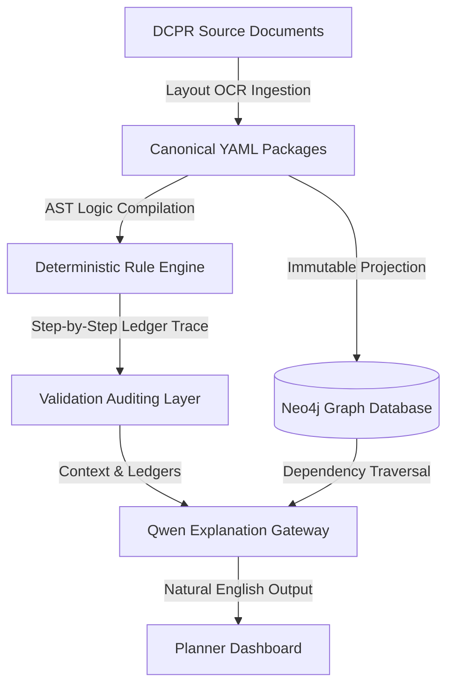
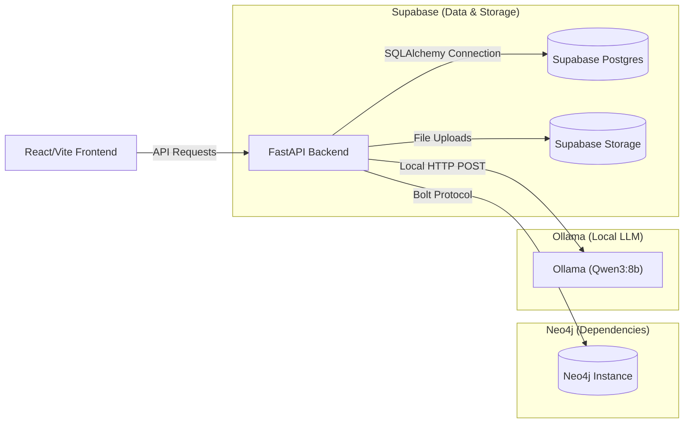

# Strategic Architecture Report: Declarative Knowledge Engine for Mumbai DCPR 2034

## 1. Executive Summary

The Mumbai Development Control and Promotion Regulations 2034 (DCPR) is a complex, hierarchical regulatory document governing urban development, FSI (Floor Space Index), and built-up area (BUA) entitlements. Traditional software approaches to coding these regulations lead to fragmented, hardcoded, and brittle calculators that are difficult to update when policies, tables, or exception criteria change.

This report outlines the **declarative, configuration-driven strategy** implemented for the DCPR Knowledge Engine. The platform represents regulatory rules as data (using a Canonical Knowledge Model in YAML), executes them using a deterministic, AST-based Rule Engine, visualizes dependencies using a graph database, and leverages local LLMs (Qwen via Ollama) solely for compiling human-friendly natural language explanations. This architecture ensures **100% mathematical accuracy**, eliminates LLM hallucination risks in quantitative calculations, and guarantees that onboarding new schemes requires zero backend code changes.

---

## 2. Core Strategy & Justification

The strategy is built on four core pillars that address the limitations of traditional software development and LLM-only approaches:

### Pillar 1: Separation of Calculations and Reasoning
* **Justification:** LLMs are notorious for mathematical hallucination and logic drift, making them unsafe for building approvals where minor rounding errors can result in millions of rupees of regulatory discrepancy. 
* **Implementation:** The calculation of FSI and BUA is handled by a custom, deterministic Python-based Rule Engine. The LLM (Qwen) is isolated in a "reasoning gateway" and acts as a read-only translation layer. It receives the inputs, outputs, and the step-by-step mathematical trace ledger, converting it into clear English explanations without performing any calculation itself.

### Pillar 2: Declarative Canonical Model (YAML over Code)
* **Justification:** Implementing schemes via hardcoded Python scripts (e.g. `if scheme_id == "33(9)": ...`) results in codebases that are impossible to audit and scale.
* **Implementation:** Every regulation, table, formula, and exception is declared as structured YAML files adhering to a strict schema. Adding support for a new scheme, such as 33(7) or 33(10), only requires registering its parameters, lookup tables, and formulas in YAML. The system is configuration-driven; the engine remains entirely scheme-agnostic.

### Pillar 3: Graph-Based Lineage and Dependency Tracking
* **Justification:** DCPR schemes are highly interdependent. For example, Scheme 33(9) references Regulation 30 (setbacks), Regulation 31(3) (fungible area), and Regulation 32 (TDR). Changing one regulation can silently break multiple schemes.
* **Implementation:** The YAML packages are compiled into a Directed Graph in Neo4j. This graph captures the precise relationships (e.g., `USES_FORMULA`, `DEPENDS_ON`, `MODIFIES`) between clauses, definitions, and formulas, allowing planners to perform automated impact analysis (e.g., "If Regulation 52 is amended, which schemes are affected?").

### Pillar 4: Service Resiliency and Fallbacks
* **Justification:** System availability must not depend on cloud API connectivity or local LLM engine uptime.
* **Implementation:** If the Neo4j instance is offline, the backend automatically falls back to an in-memory NetworkX graph (`graph.json`). If the Ollama service or the Qwen model is offline, the reasoning engine falls back to a deterministic, template-based compiler that generates structured traces.

---

## 3. Resolving the Top 3 DCPR Calculations

The platform is designed to answer the three core calculations specified in the problem statement for any DCPR scheme (using Scheme 33(9) as the demonstration model):

| Question Category | Computational Resolution Mechanism | Scheme 33(9) Demonstration Example |
|---|---|---|
| **1. Maximum Built-Up Area (BUA)** | **Calculated deterministically** as `Applicable FSI * Net Plot Area`. The system computes the Rehabilitation BUA (certified by MHADA) and adds the Incentive BUA (derived by applying Table B percentages to the Rehab component). | For `Gross Area = 8000 sq.m`, `Rehab BUA = 12000 sq.m`, and `Plot Area = 5000 sq.m`, the maximum BUA resolves to **`22,200.00 sq.m`**. |
| **2. Applicable Floor Space Index (FSI)** | **Resolved by evaluating formula DAGs**. It sums the Rehab FSI component (`Rehab BUA / Plot Area`) and the Incentive FSI component (`Incentive BUA / Plot Area`). If this sum falls below the regulatory baseline cap of 4.00, it is capped at **`4.00`**; otherwise, it resolves to the calculated sum. | The combined FSI is `2.40 (Rehab) + 2.04 (Incentive) = 4.44`. Since `4.44 > 4.00`, the final applicable FSI is **`4.44`**. |
| **3. Inclusions in FSI / BUA** | **Determined by the Canonical Model and Graph references**. The system uses the concepts registry and citation linking to specify that Rehab BUA and Incentive BUA are included in the FSI, while fungible compensatory area (under Regulation 31(3)) is strictly excluded. | The rule trace ledger explicitly includes:  1. *MHADA Rehab component* (12,000 sq. m) 2. *Incentive component* (10,200 sq. m). |

---

## 4. Integration Path (Supabase, Neo4j, Ollama)

Your setup plan is in the **right direction**. Here is how the components integrate and how to complete their configuration:

### 1. Supabase for Document Storage
* **Relational Database:** Supabase provides a fully hosted, production-grade PostgreSQL database. You can connect to it by updating `DATABASE_URL` in `backend/app/core/config.py` to your Supabase connection string. SQLAlchemy will automatically create all tables (e.g. `uploaded_files`, `calculations`, `audit_logs`) on startup.
* **Storage Bucket:** Supabase Storage (backed by S3) can store the uploaded PDF files. To integrate this, you can install the `supabase` python SDK and modify `backend/app/routers/documents.py` to upload files to a Supabase bucket instead of saving them to `settings.STORAGE_DIR`.

### 2. Neo4j for Graph database
* Since Docker is not installed on your laptop, the backend is currently running in its NetworkX fallback mode. To run a real Neo4j instance:
  * **Option A:** Install **Neo4j Desktop** (free, local Windows application) and create a local database.
  * **Option B:** Create a free **Neo4j Aura** cloud database (fully managed, takes 5 minutes to set up).
  * Update `NEO4J_URI`, `NEO4J_USER`, and `NEO4J_PASSWORD` in `backend/app/core/config.py` (or set them as environment variables). The backend will automatically apply uniqueness constraints and sync data on startup.

### 3. Ollama & Qwen Model Connection
* Your local Ollama has the `qwen3:8b` model installed and running.
* The backend is already configured to point to it by default (`OLLAMA_URL = http://localhost:11434/api/generate` and `OLLAMA_MODEL = qwen3:8b`).
* When you run the backend, the QA routes will automatically make local HTTP requests to Ollama, providing real LLM explanation summaries instead of the fallback template.

---

## 5. Conclusion & Action Plan

This architecture represents the state of the art in regulatory engineering. It satisfies the strict compliance requirements of urban planning while providing an intuitive, conversational interface for developers and planners.

### Recommended Next Steps
1. **Launch the Backend & Frontend:** Start the FastAPI backend and Vite frontend to run the interactive calculator dashboard.
2. **Verify Ollama Connection:** Query the calculator and ask a question (e.g., *"Why is applicable FSI 4.44?"*). Verify in the logs that Ollama is processing the prompt.
3. **Configure hosted Supabase Postgres & Neo4j:** Point the backend to your hosted Supabase instance and a Neo4j database to transition out of SQLite/NetworkX fallback modes.
