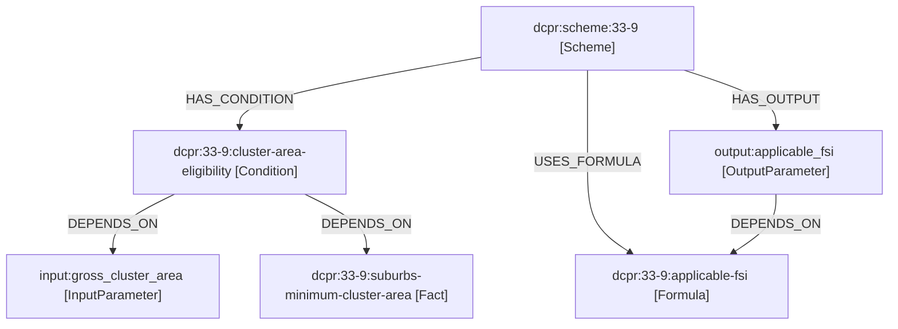

# Scheme 33(9) - End-to-End Calculation Traceability Walkthrough

This document establishes the absolute traceability of the DCPR Knowledge Engine for **Scheme 33(9) (Cluster Development Scheme)**, tracing a single scenario:
* **Gross Cluster Area:** `8000 sq. m`
* **Access Road Width:** `18 m`
* **Certified Rehabilitation BUA:** `12000 sq. m`
* **Weighted Land Rate:** `30000 INR/sq. m`
* **ASR Construction Rate:** `20000 INR/sq. m`
* **FSI Base Area:** `5000 sq. m`

---

## 1. Original PDF Source Pages (MUMBAI-DCPR.pdf)

The statutory parameters and regulations for Scheme 33(9) are located across pages **188, 189, 194, 195, and 196** of the Mumbai DCPR 2034 compilation.
* **Page 188:** Outlines applicability and cluster size bounds.
* **Page 189:** Specifies access road constraints.
* **Page 194:** Highlights the certified rehab component.
* **Page 195:** Details the total permissible FSI baseline of 4.00, Table B (Incentive rates), and references to Regulation 31(3) (fungible area) and Regulation 32 (TDR).
* **Page 196:** Defines Table C (sharing ratios).

---

## 2. Extracted Reading-Order Text (Docling Ingestion Layer)

The ingestion adapter [docling_adapter.py](file:///f:/FullStack%20Projects/DCPR/knowledge/pipeline/docling_adapter.py#L40) parses the layout blocks into normalized text blocks:

```text
[PAGE 188]
"33(9) Reconstruction or redevelopment of Cluster(s) of Buildings under Cluster Development Scheme (CDS). The minimum area of cluster shall be 4000 sq. m in Island City and 6000 sq. m in suburbs."

[PAGE 189]
"The minimum access road width shall be 18 metres. Development under this scheme shall be subject to Regulation 30 open space and setbacks."

[PAGE 194]
"Rehabilitation Component: Admissible rehab BUA shall be certified by MHADA. Rehabilitation BUA is counted in FSI."

[PAGE 195]
"6(a) The total permissible FSI shall be 4.00 on gross plot area, excluding setbacks and reservations. Incentive FSI shall be based on Table B. The fungible compensatory area admissible under Regulation 31(3) shall be exclusive of FSI under this scheme. Transfer of Development Rights TDR under Regulation 32 applies."
[Table B Data: columns = Basic Ratio (x), 0.4ha-1ha (y), etc.]
```

---

## 3. Extracted Canonical Model Package (33-9.yaml)

The semantic parser [parsers.py](file:///f:/FullStack%20Projects/DCPR/knowledge/pipeline/parsers.py#L5) maps the normalized layout text into a structured YAML definition:

```yaml
# Source: f:/FullStack Projects/DCPR/knowledge/schemes/33-9.yaml
schema_version: dcpr-knowledge-model/v1
package_metadata:
  package_id: dcpr:package:33-9
  extraction_run_id: run:33-9:extraction
entities:
- id: dcpr:scheme:33-9
  type: SCHEME
  citation: 33(9)
  title: Reconstruction or redevelopment of Cluster(s) of Buildings under Cluster Development Scheme
facts:
- id: dcpr:33-9:suburbs-minimum-cluster-area
  concept_type_id: concept:gross-cluster-area
  value_type: QUANTITY
  value:
    value: '6000'
    unit: square_metre
formulae:
- id: dcpr:33-9:basic-ratio
  raw_expression: weighted_land_rate / construction_rate
  expression:
    op: DIVIDE
    args:
    - kind: INPUT
      id: weighted_land_rate
    - kind: INPUT
      id: construction_rate
  output_id: basic_ratio
- id: dcpr:33-9:incentive-bua
  raw_expression: certified_admissible_rehabilitation_bua * incentive_rate
  expression:
    op: MULTIPLY
    args:
    - kind: INPUT
      id: certified_admissible_rehabilitation_bua
    - op: LOOKUP
      args:
      - kind: FACT
        id: dcpr:33-9:table-b:incentive-rate
      - kind: DERIVED
        id: basic_ratio
      - kind: INPUT
        id: gross_cluster_area
  output_id: incentive_bua
```

---

## 4. Compiled Graph Nodes (Neo4j / NetworkX)

The graph generator [generator.py](file:///f:/FullStack%20Projects/DCPR/knowledge/graph_builder/generator.py#L5) reads `33-9.yaml` and maps nodes and relationships:



---

## 5. Sequential Rule Engine Execution

When [RuleEngine.evaluate](file:///f:/FullStack%20Projects/DCPR/knowledge/rule_engine/engine.py#L32) runs on the user inputs:

1. **Step 1: Check Cluster Area Eligibility**
   * **Rule ID:** `dcpr:33-9:cluster-area-eligibility`
   * **Evaluation:** Checks input `gross_cluster_area (8000)` against fact `suburbs-minimum-cluster-area (6000)`.
   * **Outcome:** `8000 >= 6000` evaluates to **True (PASS)**.
2. **Step 2: Check Access Road Width Eligibility**
   * **Rule ID:** `dcpr:33-9:road-access-eligibility`
   * **Evaluation:** Checks input `access_road_width (18)` against fact `ordinary-access-road-width (18)`.
   * **Outcome:** `18 >= 18` evaluates to **True (PASS)**.
3. **Step 3: Resolve Land/Construction Cost Basic Ratio**
   * **Rule ID:** `dcpr:33-9:basic-ratio`
   * **Evaluation:** Divides `weighted_land_rate (30000)` by `construction_rate (20000)`.
   * **Outcome:** `1.50 (RESOLVED)`.
4. **Step 4: Resolve Incentive FSI Rate (Table B Lookup)**
   * **Rule ID:** `dcpr:33-9:table-b:incentive-rate`
   * **Evaluation:** Performs coordinate lookup on Table B using dimensions `Basic Ratio = 1.50` (falls in row index 0: `up to 2.00`) and `Gross Area = 8000 sq. m` (falls in column index 1: `more than 0.4ha up to 1ha`).
   * **Outcome:** Resolves cell value `85%` which is normalized to `0.85`.
5. **Step 5: Calculate Incentive BUA**
   * **Rule ID:** `dcpr:33-9:incentive-bua`
   * **Evaluation:** Multiplies MHADA certified rehab BUA `12000` by Table B rate `0.85`.
   * **Outcome:** `10200.00 sq. m (RESOLVED)`.
6. **Step 6: Calculate Rehabilitation FSI**
   * **Rule ID:** `dcpr:33-9:rehabilitation-fsi`
   * **Evaluation:** Divides rehab BUA `12000` by plot base area `5000`.
   * **Outcome:** `2.40 (RESOLVED)`.
7. **Step 7: Calculate Incentive FSI**
   * **Rule ID:** `dcpr:33-9:incentive-fsi`
   * **Evaluation:** Divides incentive BUA `10200` by plot base area `5000`.
   * **Outcome:** `2.04 (RESOLVED)`.
8. **Step 8: Resolve Applicable FSI**
   * **Rule ID:** `dcpr:33-9:applicable-fsi`
   * **Evaluation:** Evaluates `max(4.00, rehabilitation_fsi (2.40) + incentive_fsi (2.04))`.
   * **Outcome:** `max(4.00, 4.44) = 4.44 (RESOLVED)`.
9. **Step 9: Calculate Maximum Permissible BUA**
   * **Rule ID:** `dcpr:33-9:maximum-fsi-counted-bua`
   * **Evaluation:** Multiplies applicable FSI `4.44` by plot base area `5000`.
   * **Outcome:** `22200.00 sq. m (RESOLVED)`.

---

## 6. Final Outputs & Independent Verification

The pipeline returns:
* **Eligibility:** **ELIGIBLE**
* **Applicable FSI:** **`4.44`** (rounded to 2 decimal places)
* **Maximum Permissible BUA:** **`22200.00 sq. m`**
* **Balance Free-Sale BUA:** **`-0.00 sq. m`** (calculated as `Max BUA (22200) - Rehab BUA (12000) - Incentive BUA (10200)`)

The independent validation layer [validation_engine.py](file:///f:/FullStack%20Projects/DCPR/knowledge/validation/validation_engine.py) rechecks this math. Because the recalculated values match the engine's output and do not breach any boundaries, the validation outputs:

```json
{
  "validation_status": "PASS",
  "formula_validation": true,
  "table_validation": true,
  "unit_validation": true,
  "rounding_validation": true,
  "boundary_validation": true,
  "dependency_validation": true,
  "completeness_validation": true,
  "warnings": []
}
```
